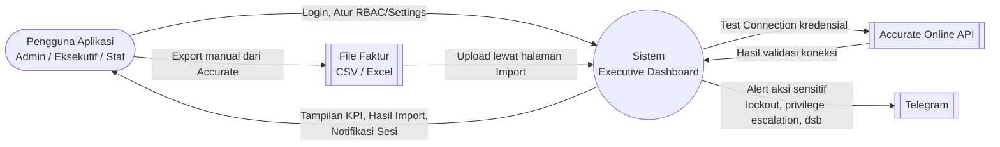
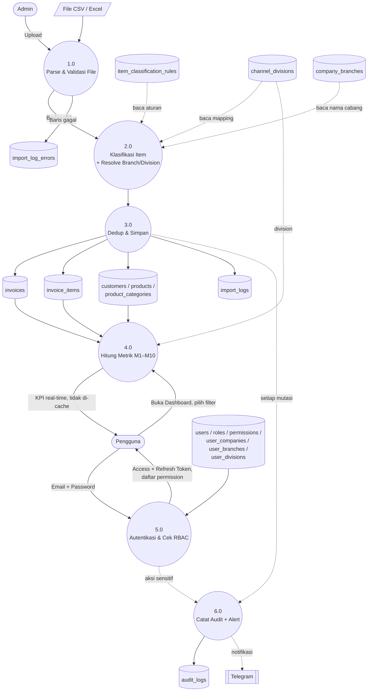
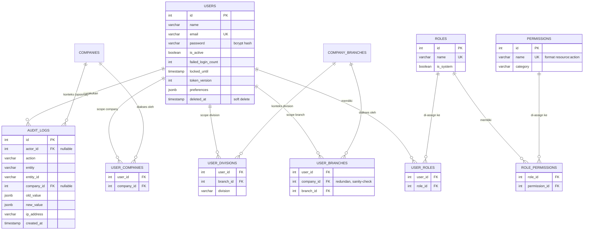

# Admin & Technical Guide — Executive Dashboard

> Dokumen referensi untuk **administrator sistem dan tim teknis** — keamanan, RBAC, konfigurasi, logic import/klasifikasi, formula perhitungan metrik, dan diagram arsitektur data (DFD/ERD). Untuk panduan pemakaian aplikasi sehari-hari oleh pengguna bisnis (membaca dashboard, memakai filter, dsb.), lihat `end_user_guide.md`.

---

## Daftar Isi

1. [Tentang Aplikasi](#1-tentang-aplikasi)
2. [Keamanan & Autentikasi](#2-keamanan--autentikasi)
3. [Manajemen Akses (RBAC)](#3-manajemen-akses-rbac)
4. [Pengaturan Pengguna (Settings)](#4-pengaturan-pengguna-settings)
5. [Struktur Menu & Modul](#5-struktur-menu--modul)
6. [Metrik & KPI — Formula Lengkap](#6-metrik--kpi--formula-lengkap)
7. [Import Data](#7-import-data)
8. [Audit Log](#8-audit-log)
9. [Aplikasi Mobile (PWA)](#9-aplikasi-mobile-pwa)
10. [Diagram Arsitektur Data (DFD & ERD)](#10-diagram-arsitektur-data-dfd--erd)

---

## 1. Tentang Aplikasi

Executive Dashboard adalah aplikasi analitik bisnis untuk perusahaan holding dengan beberapa entitas (company). Aplikasi mengolah data faktur penjualan menjadi 10 KPI (Key Performance Indicator) yang bisa dipantau eksekutif, manajer, dan staf sesuai level akses masing-masing.

**Alur bisnis inti:**

```
Admin import faktur (upload file CSV/Excel ATAU sinkron dari Accurate Online)
        ↓
Sistem parse, validasi, dan simpan ke database
        ↓
Sistem hitung 10 metrik/KPI secara on-demand
        ↓
Pengguna (Eksekutif/Manajer) lihat dashboard sesuai hak akses & scope data-nya
```

**Data ditata dalam 3 tingkat hierarki:**

```
Company (Perusahaan/Entitas)
   └── Branch (Cabang)
          └── Division (Divisi/Channel bisnis)
```

Setiap pengguna diberi akses ke kombinasi Company/Branch/Division tertentu (lihat §3.4) — jadi dua orang yang login ke aplikasi yang sama bisa melihat data yang berbeda, sesuai apa yang mereka berwenang lihat.

---

## 2. Keamanan & Autentikasi

### 2.1 Login & Sesi

- Login pakai email + password. Setelah berhasil, sistem menerbitkan **access token** (berlaku 15 menit) dan **refresh token** (berlaku 7 hari), keduanya disimpan sebagai cookie `httpOnly` (tidak bisa diakses lewat JavaScript di browser — melindungi dari serangan XSS pencurian token).
- Setiap request yang mengubah data (create/update/delete) wajib menyertakan **CSRF token** (`X-CSRF-Token` header) — mekanisme standar untuk mencegah serangan Cross-Site Request Forgery.
- Access token yang kedaluwarsa di-refresh otomatis di background menggunakan refresh token, tanpa perlu login ulang, selama refresh token masih berlaku (7 hari sejak login terakhir).
- Password disimpan ter-hash dengan bcrypt (cost factor ≥ 12) — password asli tidak pernah tersimpan maupun terlihat oleh siapa pun, termasuk admin sistem.

### 2.2 Pembatasan Percobaan (Rate Limiting)

Untuk mencegah serangan brute-force dan penyalahgunaan, setiap endpoint sensitif dibatasi jumlah percobaannya dalam jendela waktu tertentu. Kalau limit terlampaui, request ditolak dengan kode HTTP 429 dan pesan berapa detik lagi harus menunggu.

| Aksi | Batas | Jendela Waktu | Dihitung per |
|---|---|---|---|
| Login | 10 percobaan | 15 menit | Alamat IP |
| Refresh token | 30 percobaan | 15 menit | Alamat IP |
| Ubah preferensi (bahasa/tema/palette) | 20 percobaan | 5 menit | Akun (user) |
| Mutasi data User | 30 percobaan | 5 menit | Akun (user) |
| Mutasi Role/Permission | 20 percobaan | 5 menit | Akun (user) |
| Mutasi Company/Branch | 15 percobaan | 5 menit | Akun (user) |
| Mutasi Channel Division | 20 percobaan | 5 menit | Akun (user) |
| Mutasi Klasifikasi Item | 20 percobaan | 5 menit | Akun (user) |
| Mutasi Produk High Margin | 20 percobaan | 5 menit | Akun (user) |
| Mutasi Page Settings (visibility menu) | 20 percobaan | 5 menit | Akun (user) |
| Mutasi Business Config | 20 percobaan | 5 menit | Akun (user) |
| Simpan kredensial Accurate | 15 percobaan | 5 menit | Akun (user) |
| Test koneksi Accurate | 10 percobaan | 5 menit | Akun (user) |
| Import file (CSV/Excel) | 5 percobaan | 10 menit | Akun (user) |

Endpoint yang hanya membaca data (GET, lihat data tanpa mengubah) **tidak dibatasi** — pembatasan hanya berlaku untuk aksi yang mengubah data atau berpotensi disalahgunakan (login, kredensial, mutasi RBAC).

### 2.3 Penguncian Akun Otomatis (Account Lockout)

Selain rate-limit per-IP di atas, ada lapisan kedua yang mengunci **akun tertentu** (bukan cuma IP) kalau berulang kali gagal login:

- **Ambang batas:** 5 kali gagal login berturut-turut (dapat dikonfigurasi lewat environment variable, bukan hardcode).
- **Durasi kunci:** 30 menit sejak percobaan gagal ke-5 (dapat dikonfigurasi).
- Selama terkunci, **password yang benar sekalipun tetap ditolak** — mencegah penyerang yang kebetulan menebak password saat masih dalam periode kunci.
- Login yang **berhasil** mereset hitungan gagal ke nol.
- Admin dengan izin `access.user:unlock` dapat membuka kunci akun secara manual dari halaman **Users** (chip status "Terkunci" + tombol "Buka Kunci Akun").

### 2.4 Invalidasi Sesi Otomatis

Kalau admin me-reset password seorang user, **semua sesi aktif user itu di semua perangkat otomatis menjadi tidak valid** — user tersebut (atau siapa pun yang sedang memegang sesi lamanya, misal kalau akun dicurigai diretas) akan diminta login ulang di request berikutnya. Ini berlaku instan, tanpa perlu menunggu token kedaluwarsa secara alami.

### 2.5 Notifikasi Real-Time untuk Aksi Sensitif

Sistem mengirim notifikasi otomatis ke channel Telegram internal saat terjadi:

1. **Akun terkunci** (5x gagal login berturut-turut) — sinyal potensi serangan.
2. **Peningkatan hak akses (privilege escalation)** — user baru dibuat dengan role admin/superadmin, atau user lama baru diberi role tersebut; atau permission kategori Access Control (Users/Roles/Permissions) baru di-assign ke role apa pun.
3. **Aksi destruktif** — penghapusan akun admin, atau penghapusan role apa pun.
4. **Reset password ke akun admin/superadmin.**
5. **Pembukaan kunci akun manual oleh admin.**

Notifikasi ini bersifat tambahan (informational) — tidak memblokir aksi apa pun, hanya memberi visibilitas real-time ke tim keamanan/IT.

### 2.6 Perlindungan Tingkat Jaringan

- **CORS (Cross-Origin Resource Sharing):** hanya origin/domain yang di-whitelist eksplisit (dikonfigurasi lewat environment variable) yang boleh memanggil API — bukan wildcard terbuka.
- **Security Headers:** setiap response menyertakan header standar keamanan web —
  - `X-Frame-Options: DENY` — halaman tidak bisa disisipkan ke `<iframe>` situs lain (mencegah clickjacking).
  - `X-Content-Type-Options: nosniff` — mencegah browser "menebak" tipe konten yang salah.
  - `Strict-Transport-Security` — memaksa koneksi HTTPS (aktif hanya di production).
  - `Referrer-Policy: no-referrer` — URL halaman tidak dikirim ke situs lain saat klik link keluar.
- Setiap kesalahan server **tidak pernah menampilkan stack trace atau detail teknis** ke pengguna — pesan error yang tampil selalu sudah disaring.

---

## 3. Manajemen Akses (RBAC)

RBAC (Role-Based Access Control) di aplikasi ini sepenuhnya dinamis — dikelola dari dashboard, bukan hardcode di kode program.

### 3.1 Role Bawaan

| Role | Sistem? | Cakupan Akses |
|---|---|---|
| **Super Admin** | Ya (tidak bisa dihapus) | Semua permission tanpa kecuali — termasuk Configuration (Integrasi Accurate, Feature Flags) yang eksklusif untuk role ini. |
| **Admin** | Tidak (bisa disesuaikan) | Akses penuh ke seluruh menu bisnis inti (Dashboard, Customer/Product/Transaction Workbench). Di menu Administration hanya sampai Settings (Company/Branch, Channel Division, Product Settings — view+update saja, tanpa create/delete). Menu Configuration tidak bisa diakses sama sekali. Access Control (Users/Roles/Permissions) dan Audit Log hanya bisa dilihat (view), tidak bisa diubah. |
| **User** | Tidak (bisa disesuaikan) | Hanya bisa melihat (view) dan mengekspor data di menu bisnis inti. Tidak ada akses ke menu Administration sama sekali. |

Role `Admin` dan `User` bisa diubah/dihapus/di-rename sesuai kebutuhan lewat halaman **RBAC** — permission di atas hanyalah baseline default saat instalasi awal.

### 3.2 Dua Sumbu Akses yang Terpisah — Wajib Dipahami

RBAC di aplikasi ini bekerja lewat **dua sumbu independen** yang **sama-sama harus terpenuhi** sebelum seorang user bisa melihat/mengubah sesuatu:

| Sumbu | Menjawab pertanyaan | Diatur lewat | Contoh |
|---|---|---|---|
| **1. Permission (Role)** | "Boleh melakukan APA?" | Halaman **RBAC** — assign permission ke Role | Role "Sales Manager" boleh `customer:view` tapi tidak boleh `customer:delete` |
| **2. Scope (Company/Branch/Division)** | "Boleh lihat data SIAPA/MANA?" | Halaman **Users** — assign Company/Branch/Division ke user tertentu | User "Budi" cuma diberi akses ke Company "PT A", Branch "Jakarta" |

**Keduanya independen dan sama-sama wajib.** Dua user dengan **role yang sama persis** (jadi boleh melakukan aksi yang sama) tetap bisa melihat **data yang berbeda total** kalau scope Company/Branch/Division mereka berbeda. Sebaliknya, dua user yang di-assign ke **Company yang sama** tetap bisa punya kemampuan aksi yang berbeda kalau role mereka berbeda (satu cuma bisa lihat, satu lagi bisa edit).

Analogi sederhana: **Permission = jabatan/wewenang** (apa yang boleh dikerjakan), **Scope = wilayah kerja** (data cabang/entitas mana yang boleh dilihat). Seorang "Manager" (permission) di cabang Jakarta (scope) tidak otomatis jadi Manager di cabang Surabaya juga — kedua hal itu diatur terpisah.

### 3.3 Cara Kerja Permission

- Format permission: `<resource>:<action>` — contoh `customer:view`, `access.user:create`, `settings.company:delete`.
- Setiap halaman punya permission `:menu` (menentukan apakah menu muncul di sidebar) yang terpisah dari permission `:view`/`:create`/`:update`/`:delete` (menentukan aksi apa yang boleh dilakukan setelah halaman dibuka). Contoh: user bisa saja diberi `customer:menu` (menu Customer muncul di sidebar) tapi TIDAK diberi `customer:export` — menu tetap muncul dan bisa dibuka, tapi tombol Export tidak akan terlihat sama sekali.
- Tombol aksi (Tambah, Edit, Hapus) otomatis tersembunyi kalau user tidak punya permission terkait — bukan cuma dinonaktifkan (disabled) jadi abu-abu, tapi benar-benar tidak dirender ke halaman.
- Permission diperiksa ulang di **backend (server)** setiap request, bukan hanya disembunyikan di tampilan — jadi tidak bisa "dibobol" dengan memanggil API langsung lewat cara teknis apa pun, sekalipun tombolnya berhasil dimunculkan paksa di browser.
- **Menu induk** (Settings, Configuration, Access Control) **tidak punya permission sendiri** — visibilitasnya otomatis mengikuti: kalau minimal satu sub-halaman di dalamnya visible untuk user itu, menu induknya ikut muncul; kalau semua sub-halaman di dalamnya tidak visible, menu induk ikut hilang total (bukan muncul kosong).

#### Daftar Lengkap Kategori Permission (24 kategori, 88 permission)

| Kategori | Prefix Key | Aksi yang Tersedia |
|---|---|---|
| Dashboard | `dashboard` | menu, view |
| Customer | `customer` | menu, view, export |
| Expansion Targets | `expansion` | menu, view, export |
| Churn Risk | `churn.risk` | menu, view, export |
| Cross Selling | `cross.selling` | menu, view, export |
| Product | `product` | menu, view, export |
| High Margin | `high.margin` | menu, view, export |
| Product Trend | `product.trend` | menu, view, export |
| Transaction | `transaction` | menu, view, export |
| Project | `project` | menu, view |
| App Settings | `settings.app` | menu, view, update |
| Company | `settings.company` | menu, view, create, update, delete |
| Branch | `settings.branch` | view, create, update, delete *(tanpa menu sendiri — bagian dari halaman Company)* |
| Channel Division | `settings.channel.division` | menu, view, create, update, delete |
| Product Settings (High Margin config) | `settings.product` | menu, view, create, update, delete |
| Threshold | `settings.threshold` | menu, view, update |
| Classification | `config.classification` | menu, view, create, update, delete |
| Import | `config.import` | menu, view, import |
| Integration | `config.integration` | menu, view, create, update, test, reset |
| Features | `config.features` | menu, view, update |
| Users | `access.user` | menu, view, create, update, delete, unlock |
| Roles | `access.role` | menu, view, create, update, delete |
| Permissions | `access.permission` | view, update *(tanpa menu sendiri — bagian dari halaman RBAC)* |
| Audit Log | `audit.log` | menu, view, export |

**Prinsip penting:** tiap halaman punya permission `:menu`-nya sendiri-sendiri. Memberi `customer:menu` **tidak** otomatis menampilkan menu Expansion Targets/Churn Risk/Cross Selling meskipun sama-sama di grup Customer Workbench — masing-masing harus diaktifkan eksplisit satu per satu.

### 3.4 Halaman RBAC — Membuat Role Baru & Mengatur Permission

Dari menu **Administration → Access Control → RBAC**, admin (dengan permission `access.role:create`) dapat membuat role custom:

1. Klik tombol **Add Role**, isi nama dan deskripsi role baru (contoh: "Sales Manager Cabang").
2. Role baru otomatis dibuat **tanpa permission apa pun** (kosong total) — perlu langkah berikutnya untuk mengaktifkan akses.
3. Klik ikon perisai (**Assign Permissions**) pada role tersebut — terbuka dialog matrix berisi checklist, dikelompokkan per kategori (24 kategori di atas), dengan kolom aksi yang otomatis menyesuaikan (menu/view/create/update/delete/dst, tergantung aksi apa saja yang tersedia untuk kategori itu).
4. Centang kombinasi permission yang diinginkan, simpan.

Kalau user yang login hanya punya permission `access.permission:view` (tanpa `:update`), dialog yang sama tetap bisa dibuka untuk **melihat** konfigurasi permission role apa pun (badge "Read Only" muncul, semua checkbox ter-disable) — tapi tidak bisa mengubah apa pun.

Role bawaan `Admin`/`User` (non-sistem) bisa di-rename atau dihapus lewat halaman ini juga kalau memang tidak dibutuhkan — hanya role **Super Admin** yang dikunci permanen (tidak bisa dihapus/di-rename, ditandai sebagai role sistem).

### 3.5 Halaman Users — Assign Role & Scope ke Pengguna

Dari menu **Administration → Access Control → Users**, admin (dengan permission `access.user:create`/`:update`) mengatur user secara individual:

1. **Assign Role** — satu user diberi satu Role (menentukan sumbu **Permission**, lihat §3.2).
2. **Assign Company/Branch/Division** — dipilih berjenjang: pilih Company dulu, baru muncul pilihan Branch di dalam Company itu, baru muncul pilihan Division di dalam Branch itu (menentukan sumbu **Scope**, lihat §3.6). Satu user bisa diberi akses ke lebih dari satu Company/Branch/Division sekaligus.
3. Halaman ini juga tempat untuk: reset password user (memicu invalidasi sesi otomatis, lihat §2.4), kunci/buka-kunci akun manual (lihat §2.3), lihat status aktif/terkunci tiap user, dan bulk-import user baru dari file (lihat §7.5).

### 3.6 Hierarki Isolasi Data — Company → Branch → Division

Setiap user diberi akses ke kombinasi tertentu dari 3 tingkat hierarki data:

```
Company (mis. PT A, PT B, PT C)
   └── Branch/Cabang (mis. Jakarta, Surabaya)
          └── Division/Channel (mis. Distribution, Project, Retail)
```

Aturan aksesnya berjenjang: seorang user **harus** diberi akses ke sebuah Company dulu sebelum bisa diberi akses ke Branch di dalamnya, dan harus punya akses Branch dulu sebelum bisa diberi akses Division di dalam branch itu. User yang tidak diberi akses eksplisit ke sebuah Company/Branch/Division **tidak akan melihat data apa pun** dari situ (default deny, bukan default allow).

**Pengecualian:** Super Admin melewati (bypass) seluruh pembatasan ini dan selalu bisa melihat semua data di semua entitas.

Filter Company/Branch/Division muncul otomatis di hampir semua halaman data (Dashboard, Customer, Transactions, Products, dst.) — opsi yang muncul di dropdown filter itu sendiri **sudah disaring** sesuai scope akses user (user tidak akan melihat opsi company/branch/division yang bukan haknya sama sekali).

### 3.7 Isolasi Khusus Data Super Admin

Data milik akun Super Admin (baik di daftar User maupun Audit Log) **disembunyikan total** dari siapa pun yang bukan Super Admin — walaupun role itu punya permission `access.user:view`/`audit.log:view` secara umum. Sesama Super Admin tetap saling terlihat penuh.

---

## 4. Pengaturan Pengguna (Settings)

Halaman **Administration → Settings → App Settings** menyediakan preferensi personal yang **tersimpan ke akun** (bukan hanya di browser) — jadi preferensi yang sama akan diterapkan di perangkat/browser mana pun user login.

### 4.1 Bahasa

Dua bahasa didukung penuh (100% coverage, tidak ada teks yang belum diterjemahkan):

- **Bahasa Indonesia**
- **English**

### 4.2 Tema Tampilan

- **Light Mode** — visibilitas lebih baik di lingkungan terang.
- **Dark Mode** — mengurangi ketegangan mata di lingkungan redup.

Perpindahan tema menggunakan animasi transisi melingkar (circular reveal) dari titik tombol toggle diklik.

### 4.3 Palette Warna

6 pilihan warna aksen (memengaruhi warna tombol, highlight, judul halaman, dan AppBar):

| Palette | Warna Utama | Warna Sekunder |
|---|---|---|
| **Blue** (default) | Biru | Ungu (violet) |
| **Green** | Hijau | Teal |
| **Yellow** | Amber | Oranye |
| **Purple** | Ungu (purple) | Fuchsia |
| **Rose** | Merah muda tua (rose) | Pink |
| **Indigo** | Indigo | Biru langit (sky) |

Catatan penting: warna **status/semantik** (hijau=sukses, kuning=peringatan, merah=error, cyan=info) **selalu sama** di semua palette — supaya sinyal status tidak pernah membingungkan (misal, kalau memilih palette hijau, pesan "error" tetap merah, bukan ikut jadi hijau).

### 4.4 Avatar & Menu Akun

Pojok kanan atas AppBar menampilkan avatar (inisial nama) yang saat diklik membuka menu berisi: nama, email, Company/Branch/Division yang di-assign ke user (ringkas, dengan indikator "+N lainnya" kalau banyak), tombol ke halaman Settings, dan tombol Logout.

---

## 5. Struktur Menu & Modul

### Group 1 — Executive Dashboard
| Halaman | Fungsi |
|---|---|
| **Dashboard** | Ringkasan seluruh 10 KPI dalam satu tampilan, dengan filter Company/Branch/Division. |

### Group 2 — Customer Workbench
| Halaman | Fungsi |
|---|---|
| **Customer** | Daftar master pelanggan — pencarian, detail riwayat transaksi per pelanggan. |
| **Expansion Targets** (`/customer-metrics`) | KPI M3–M7: Revenue, Gross Profit, High Margin Penetration, Repeat Order Rate, Customer Expansion Rate. |
| **Churn Risk** (`/dormant-customer`) | KPI M8–M10: Dormant Customer Rate, Dormant Value, Reactivation Rate. |
| **Cross Sell Matrix** (`/cross-selling`) | KPI M1–M2: Cross Selling Ratio, Average Category per Customer. |

### Group 3 — Product & Portfolio
| Halaman | Fungsi |
|---|---|
| **Product Ledger** | Daftar & performa kategori produk. |
| **High Margin Push** | Laporan penetrasi kategori high-margin + daftar target upsell pelanggan. |
| **Product Trend** | Tren rata-rata kategori produk yang dibeli dari waktu ke waktu. |

### Group 4 — Transaction & Revenue
| Halaman | Fungsi |
|---|---|
| **Transaction Ledger** | Daftar seluruh faktur/invoice, dapat difilter Company/Branch/Division/periode. |
| **Project Milestone** | (Placeholder — belum ada fitur backend aktif). |

### Group 5 — Administration
| Sub-menu | Halaman | Fungsi |
|---|---|---|
| **Settings** | App Settings | Bahasa, tema, palette (lihat §4). |
| | Companies | Kelola daftar Company & Branch di dalamnya. |
| | Channel Divisions | Mapping nama channel penjualan → Division. |
| | High Margin Products | Tentukan produk/kategori mana yang dianggap high-margin per periode. |
| | Threshold | Atur target KPI (mis. target Repeat Order Rate) tanpa perlu deploy ulang aplikasi. |
| **Configuration** *(khusus Super Admin)* | Classification Rules | Aturan otomatis klasifikasi jenis item dari data import. |
| | Import | Halaman terpusat upload data (lihat §7). |
| | Integration | Kredensial & koneksi ke Accurate Online API. |
| | Features | Toggle on/off visibility tiap halaman aplikasi. |
| **Access Control** | Users | Kelola pengguna (lihat §3.3). |
| | RBAC | Kelola role & permission (lihat §3.3). |
| **Audit Log** | — | Riwayat seluruh aksi mutasi data di sistem (lihat §8). |

---

## 6. Metrik & KPI — Formula Lengkap

Semua metrik dihitung dari data faktur (`invoices` + `invoice_items`) yang sudah diimport — tidak ada sumber data lain. Perhitungan dilakukan di server (backend) secara on-demand, bukan di browser.

### Definisi Status Pelanggan (dasar semua metrik)

Status dihitung relatif terhadap **tanggal acuan** (`period_end`, default hari ini) dan **window aktif 30 hari rolling** mundur dari tanggal itu:

| Status | Kondisi |
|---|---|
| **Aktif** | Ada transaksi dalam 30 hari terakhir dari tanggal acuan. |
| **Existing** | Pertama kali beli **sebelum** 30 hari terakhir, DAN masih bertransaksi dalam 90 hari terakhir (belum dormant). |
| **Dormant** | Tidak ada transaksi sama sekali dalam 90 hari terakhir. |
| **New** | Pertama kali beli **dalam** 30 hari terakhir ini. |

### M1 — Cross Selling Ratio

Persentase pelanggan aktif yang dalam transaksinya membeli **lebih dari 1 kategori produk berbeda**.

```
M1 (%) = COUNT(pelanggan aktif dengan ≥2 kategori produk berbeda)
        ÷ COUNT(TOTAL pelanggan aktif)
```

### M2 — Average Category per Customer

Rata-rata jumlah jenis kategori produk yang dibeli per pelanggan aktif.

```
M2 = COUNT(kategori unik yang terjual di periode ini)
    ÷ COUNT(pelanggan aktif di periode ini)
```

### M3 — Average Revenue per Existing Customer

Rata-rata pendapatan dari pelanggan existing yang benar-benar bertransaksi bulan itu.

```
M3 = SUM(revenue dari existing customer yang transaksi)
    ÷ COUNT(existing customer yang transaksi)
```

Dilengkapi indikator **konsentrasi**: kalau satu pelanggan menyumbang >25% dari total revenue existing bulan itu, muncul tanda peringatan (⚠) di chart.

### M4 — Average Gross Profit per Existing Customer (dengan Tier)

Rata-rata gross profit dari existing customer, dipecah jadi 3 tingkat (tier) berdasarkan **median GP** bulan itu:

```
M4 = SUM(gross profit existing yang transaksi) ÷ COUNT(existing yang transaksi)

Tier Atas   : GP individu > median GP
Tier Tengah : 0.5×median < GP individu ≤ median GP
Tier Bawah  : GP individu ≤ 0.5×median GP
```

Juga dilengkapi indikator konsentrasi (sama seperti M3) dan modal drill-down berisi ranking lengkap per pelanggan (dapat diekspor PDF).

### M5 — High Margin Product Penetration

Persentase existing customer yang membeli **minimal 1 produk kategori high-margin** bulan itu.

```
M5 (%) = COUNT(existing customer yang beli ≥1 produk high-margin)
        ÷ COUNT(TOTAL existing customer)     ← termasuk yang tidak transaksi bulan itu
```

**Produk high-margin ditentukan otomatis dari data**, bukan input manual, berdasarkan margin rate aktual tiap produk:

```
margin_rate produk = SUM(gross profit produk) ÷ SUM(revenue produk) × 100

Threshold "high margin":
  - Mode Otomatis (default): median margin_rate dari semua produk yang terjual bulan itu
  - Mode Manual (opsional):  nilai tetap, dikonfigurasi di Settings → Threshold
```

### M6 — Repeat Order Rate

Persentase existing customer yang bertransaksi **lebih dari 1 kali** (bukan sekadar pernah beli) dalam 30 hari terakhir.

```
M6 (%) = COUNT(existing customer dengan ≥2 invoice berbeda dalam 30 hari)
        ÷ COUNT(TOTAL existing customer)
```

Target KPI ini dapat dikonfigurasi (default 80%) di **Settings → Threshold**, tanpa perlu update aplikasi. Indikator warna:
- **Hijau** — mencapai ≥100% dari target
- **Kuning** — mencapai ≥75% dari target
- **Merah** — di bawah 75% dari target

### M7 — Customer Expansion Rate

Persentase existing customer yang pengeluarannya (spending) **naik** dibanding 30 hari sebelumnya.

```
Window sekarang    = revenue existing dalam 30 hari terakhir
Window sebelumnya  = revenue existing dalam 30 hari sebelum itu (hari ke-31 s/d ke-60 dari acuan)

M7 (%) = COUNT(existing customer dengan revenue_sekarang > revenue_sebelumnya)
        ÷ COUNT(TOTAL existing customer)
```

Pelanggan yang tidak order di window sebelumnya tapi order sekarang tetap dihitung sebagai "naik".

### M8 — Dormant Customer Rate

Persentase pelanggan yang tidak bertransaksi sama sekali selama 90 hari, dari **seluruh** pelanggan (bukan cuma existing).

```
M8 (%) = COUNT(pelanggan dengan transaksi terakhir >90 hari lalu)
        ÷ COUNT(SELURUH pelanggan di database)
```

Ditampilkan dengan garis ambang batas (default 10%) — area di atasnya ditandai sebagai kondisi kritis.

### M9 — Dormant Customer Value

Estimasi nilai (rupiah) yang berpotensi hilang dari tiap pelanggan dormant.

```
M9 = Rata-rata revenue bulanan (dari histori sebelum dormant) × Jumlah bulan sudah dormant
```

Ditampilkan sebagai ranking pelanggan dormant dengan potensi kerugian terbesar.

### M10 — Customer Reactivation Rate

Persentase pelanggan dormant periode lalu yang **kembali bertransaksi** di periode ini.

```
M10 (%) = COUNT(pelanggan dormant periode lalu yang kembali order)
         ÷ COUNT(TOTAL pelanggan dormant periode lalu)
```

Target minimum yang disarankan: 15–20%.

---

## 7. Import Data

Semua data masuk lewat satu halaman terpusat (**Administration → Configuration → Import**), dengan **4 jenis import** yang dipilih lewat dropdown "Tipe Import". Setiap jenis punya tombol **Download Template** sendiri, dan wajib pilih Company tujuan sebelum upload (data selalu masuk ter-scope ke Company yang dipilih).

| Jenis | Endpoint | Kebutuhan Tambahan | Isi |
|---|---|---|---|
| **Faktur** | `POST /import/csv` | Company + periode (bulan) | Data invoice/faktur penjualan — sumber utama seluruh metrik. |
| **Channel Divisions** | `POST /settings/channel-divisions/import` | Company | Mapping nama channel penjualan → Division. |
| **Klasifikasi Item** | `POST /classification-rules/import` | Company | Aturan otomatis pengelompokan jenis barang. |
| **User Baru** | `POST /users/import` | `default_password` (bukan per Company) | Bulk-create akun pengguna. |

### 7.1 Kenapa Wajib Pakai Download Template

Tombol **Download Template** menghasilkan file `.xlsx` yang sudah berisi:
1. **Judul** — nama template yang jelas.
2. **Deskripsi tiap kolom** — termasuk nilai-nilai yang valid untuk kolom enum (misal daftar lengkap `division` yang diterima, atau `match_type` yang diterima klasifikasi).
3. **Baris header** — nama kolom **persis** seperti yang dikenali sistem.
4. **Beberapa baris contoh data** siap pakai sebagai acuan format.

**Ini cara paling efektif mengurangi error saat import**, karena kesalahan import hampir selalu berasal dari salah satu dari dua hal: (a) nama kolom yang tidak dikenali sistem, atau (b) nilai enum yang salah ketik (misal menulis "distribusi" padahal yang valid adalah `distribution`). Template menghilangkan kedua sumber error itu sejak awal.

### 7.2 Import Faktur — Metode yang Tersedia Saat Ini

**Satu-satunya cara yang benar-benar berfungsi saat ini adalah upload file** — terima `.csv` atau `.xlsx`, maksimal **10MB**. Ada 2 mode teknis: sekali-jalan (tunggu sampai selesai) atau **streaming progress** (SSE — Server-Sent Events) yang menampilkan progress bar real-time berapa baris sudah diproses/sukses/gagal saat file besar sedang diproses.

> **Sinkron otomatis langsung dari Accurate Online (tanpa export-import file manual) BELUM tersedia** — lihat status detail di §7.7. Alur kerja yang berlaku sekarang: export data dari Accurate Online jadi file Excel/CSV, lalu upload file itu ke halaman Import seperti biasa.

#### Logic Parsing File Faktur (detail teknis)

Parser dirancang **toleran terhadap variasi nama kolom** — tidak memaksa nama kolom persis satu bentuk baku, tapi mengenali banyak alias sekaligus (Bahasa Indonesia maupun Inggris). Contoh, kolom nomor faktur bisa ditulis sebagai salah satu dari: `invoice_number`, `Invoice No`, `No Faktur`, `Nomor Faktur`, `Faktur`, `Invoice`, dst — semuanya otomatis dipetakan ke field internal yang sama.

**Langkah normalisasi nama kolom:** setiap nama kolom di-lowercase, karakter selain huruf/angka/spasi/underscore dibuang, lalu spasi diganti underscore — supaya `"No. Faktur"`, `"no_faktur"`, dan `"NO FAKTUR"` semuanya dikenali sebagai kolom yang sama.

**Kolom yang wajib ada (minimal salah satu alias-nya ditemukan):**
| Field Internal | Fungsi |
|---|---|
| `invoice_number` | Nomor faktur — kunci deduplikasi |
| `invoice_date` | Tanggal transaksi |
| `customer_code` | Kode pelanggan |
| `customer_name` | Nama pelanggan |
| `product_category` | Kategori produk |
| `revenue` | Nilai penjualan |
| `gross_profit` | Laba kotor |

Kalau ada kolom wajib yang alias-nya sama sekali tidak ditemukan di file, **seluruh import ditolak sejak awal** (sebelum baris data mana pun diproses) dengan pesan jelas kolom apa yang hilang.

**Untuk file Excel dari export resmi Accurate** ("Rincian Faktur Penjualan"), parser justru lebih ketat — mendeteksi baris header secara dinamis (memindai 10 baris pertama file mencari baris yang mengandung persis kolom `"Tanggal"` dan `"Sales Invoice"`, supaya file boleh punya baris judul/metadata di atas tabel data tanpa mengganggu parsing), lalu memvalidasi bahwa **semua kolom yang ada memang dikenali** (bukan cuma cek kolom wajib ada, tapi juga menolak kalau ada kolom asing yang tidak dikenali sama sekali — mengindikasikan file bukan hasil export template resmi).

Baris yang dianggap **bukan data valid** (dan dilewati otomatis, bukan error) meliputi: baris kosong, baris footer laporan (mengandung teks seperti "ACCURATE Accounting System", "Tercetak pada", "Halaman"), atau baris yang nomor invoicenya tidak diawali `SI.` atau `INV-`.

**Validasi per baris data** (baris yang lolos tahap ini baru benar-benar diproses):
- `invoice_number`, `invoice_date`, `customer_code`, `customer_name` tidak boleh kosong.
- Kolom angka (`revenue`, `gross_profit`, dst.) harus bisa di-parse sebagai angka (koma otomatis dikonversi jadi titik desimal) — kalau gagal, baris itu dicatat sebagai error dan **dilewati**, tapi baris lain tetap lanjut diproses (tidak menggagalkan keseluruhan file).
- Format tanggal didukung otomatis dalam beberapa bentuk: `DD/MM/YYYY`, `YYYY-MM-DD`, atau format teks Accurate seperti `"02 Jun 2026"` — semuanya dikonversi ke format internal yang sama.

#### Pipeline Lengkap Setelah Parsing

```
Parse file → validasi per baris → klasifikasi item_type otomatis (lihat §7.3)
  → resolve branch_id dari nama cabang → DEDUP+UPSERT per invoice_number+company_id:
      • Faktur baru        → INSERT header + item
      • Faktur sudah ada   → UPDATE header, HAPUS item lama, INSERT item baru
  → upsert master data (customer/kategori/produk baru otomatis ditambahkan)
  → catat ringkasan hasil + daftar baris error
```

Import **idempotent** — mengimpor ulang file yang sama persis tidak akan menggandakan data, karena kunci deduplikasi (`invoice_number` + Company) memastikan faktur yang sudah ada di-update, bukan diduplikasi.

**Resolusi Cabang (Branch) otomatis:** nama cabang di file dicocokkan (tanpa peduli besar-kecil huruf) ke daftar Branch yang terdaftar di Company itu. Kalau nama cabang di file kosong, faktur otomatis masuk ke Branch "Lainnya". Kalau nama cabang terisi tapi **tidak cocok** dengan Branch manapun yang terdaftar, sistem membiarkan field itu kosong sebagai sinyal bahwa nama cabang tersebut perlu diperiksa manual (kemungkinan typo atau Branch belum didaftarkan).

### 7.3 Logic Klasifikasi Otomatis Jenis Barang

Setiap baris item faktur (spare part, jasa, dsb.) diklasifikasikan otomatis ke salah satu dari 4 tipe: **unit**, **consumable** (barang habis pakai), **sparepart**, atau **service** (jasa). Klasifikasi ini memakai mesin aturan (rule engine) bertingkat 4 lapis, dicek berurutan sampai ada yang cocok:

```
Lapis 1 — keyword_item_name : cocokkan kata kunci pada NAMA ITEM
Lapis 2 — keyword_category  : cocokkan kata kunci pada NAMA KATEGORI
Lapis 3 — price_range       : tebakan berdasarkan rentang harga satuan
Lapis 4 — fallback          : kalau semua lapis di atas tidak ada yang cocok,
                               default ke 'unit' + ditandai "perlu ditinjau"
```

Kalau ada **lebih dari satu aturan yang cocok** untuk item yang sama, aturan dengan **priority (prioritas) tertinggi yang menang**. Prioritas terisi otomatis berdasarkan jenis pencocokan (semakin spesifik jenis pencocokannya, semakin tinggi prioritas defaultnya), tapi bisa juga diatur manual (0–1000) saat membuat aturan:

| Jenis Pencocokan | Prioritas Default |
|---|---|
| Nama item persis sama (exact) | 100 |
| Kategori persis sama (exact) | 90 |
| Kata kunci di nama item | 70 |
| Kata kunci di kategori | 50 |
| Rentang harga | 30 |

**Aturan bisa berlaku global** (untuk semua Company) **atau khusus satu Company** (override) — aturan yang dibuat lewat import selalu ter-scope ke Company yang dipilih saat upload. Aturan juga bisa dinonaktifkan sementara tanpa dihapus (berguna untuk uji coba perubahan aturan).

Template import klasifikasi berisi 3 kolom: `match_type` (jenis pencocokan), `match_pattern` (kata kunci atau rentang harga dalam format tertentu), `item_type` (hasil klasifikasi) — dilengkapi 16 baris contoh mencakup semua jenis pencocokan yang didukung.

### 7.4 Logic Mapping Channel → Division

Setiap transaksi punya kolom "Nama Tenaga Penjual"/nama channel penjualan mentah dari data sumber (misal `"DC WEST"`, `"TOKOPEDIA"`). Sistem memetakan nilai mentah ini ke satu dari 6 kategori Division bisnis:

| Division | Contoh Channel |
|---|---|
| `distribution` | Cabang distribusi fisik (mis. "DC WEST", "DC EAST") |
| `project` | Saluran B2B/proyek (mis. "SDR B2B WEST", "KAE WEST") |
| `e_commerce` | Marketplace online (mis. "TOKOPEDIA", "TIKTOKSHOP", "LAZADA") |
| `intercompany` | Transaksi antar-entitas dalam holding |
| `freelancer` | Salesperson lepas/freelance |
| `support` | Sales support / channel internal |

Mapping ini **bisa berbeda per Company** (override) atau berlaku global untuk semua Company. Kalau nama channel baru muncul di data faktur tapi belum ada pemetaannya, customer terkait akan tampil dengan Division kosong (`null`) di laporan — sinyal bagi admin untuk menambahkan pemetaan baru lewat halaman **Settings → Channel Divisions** atau import ulang lewat template.

Template import berisi 2 kolom: `channel_name`, `division` — nama channel otomatis diseragamkan jadi huruf kapital semua saat disimpan, supaya pencocokan dengan data faktur (yang juga disimpan huruf kapital) selalu konsisten.

### 7.5 Import User Massal

Khusus untuk penambahan banyak akun pengguna sekaligus (misal saat onboarding tim baru), tersedia tipe import **"User Baru"** di halaman yang sama.

**Kolom template:** `name` (wajib), `email` (wajib), `role` (opsional — nama role yang sudah ada, lihat §3.1), `company_code` (opsional — bisa lebih dari satu Company, dipisah koma, contoh: `"PT01,PT02"`).

**Cara kerja:** saat upload, admin mengisi satu **password default** yang dipakai untuk SEMUA akun baru dari file itu (bukan per baris) — pengguna disarankan segera mengganti password masing-masing setelah login pertama. Password default ini **tidak pernah disimpan** sebagai konfigurasi permanen di server, hanya dipakai sekali saat proses import berjalan.

**Aturan per baris:**
1. `name`/`email` kosong → baris gagal (dicatat sebagai error).
2. Email yang sudah terdaftar sebelumnya → **dilewati** (bukan dianggap error — aman untuk mengimpor ulang file yang sama, user yang sudah ada tidak akan dibuat dobel).
3. Nama role diisi tapi tidak ditemukan dalam sistem → baris gagal.
4. Kode company diisi tapi ada yang tidak dikenal → baris gagal.
5. Semua valid → akun dibuat dengan password default (langsung ter-hash), role dan akses company/branch/division di-assign sesuai isian.

### 7.6 Penanganan Error saat Import

Untuk **semua** jenis import (faktur, divisi, klasifikasi, user), prinsip yang sama berlaku: **kegagalan di satu baris tidak menggagalkan keseluruhan file**. Baris yang valid tetap masuk ke database; baris yang gagal dicatat terpisah lengkap dengan nomor baris dan pesan error spesifiknya, sehingga admin bisa memperbaiki baris tersebut saja dan mengimpor ulang (baris yang sudah berhasil tidak akan terduplikasi karena mekanisme dedup/skip di atas).

Riwayat setiap operasi import (khusus faktur) tersimpan permanen dan bisa dilihat kembali lewat log import — termasuk status akhir (`success`/`partial`/`failed`), jumlah baris sukses vs gagal, dan detail pesan error tiap baris yang gagal.

### 7.7 Integrasi Accurate Online

Menu **Configuration → Integration** menyediakan pengaturan koneksi ke Accurate Online API. Penting untuk dipahami: fitur ini **baru sebagian selesai dibangun** — bagian penyimpanan kredensial dan uji koneksi sudah berfungsi penuh, tapi **fitur menarik (sinkronisasi) data faktur langsung dari Accurate belum tersedia**. Berikut rincian per bagian:

#### Yang Sudah Berfungsi

- **Simpan kredensial** — API Token + Signature Secret per Branch dimasukkan lewat form, langsung **dienkripsi (AES-256-GCM)** sebelum disimpan ke database. Setelah tersimpan, nilai aslinya tidak pernah dikirim kembali ke browser dalam bentuk terbuka — bahkan admin yang menyimpannya tidak bisa melihatnya lagi lewat aplikasi, hanya metadata seperti subdomain dan status aktif.
- **Test Connection** — tombol untuk memvalidasi kredensial yang dimasukkan benar-benar bisa terhubung ke Accurate Online, sebelum disimpan permanen. Sistem mengirim request ter-otentikasi (HMAC-SHA256 signature) ke endpoint resmi Accurate dan menampilkan hasilnya (nama aplikasi, database, user) kalau berhasil, atau pesan error yang jelas kalau kredensial salah/koneksi gagal (timeout 15 detik).

#### Yang Belum Tersedia (Sinkronisasi Data)

**Tidak ada tombol atau proses "Sync Now" yang benar-benar menarik data faktur dari Accurate ke aplikasi ini.** Yang sudah ada di level kode adalah:
- Sebuah *client* teknis untuk memanggil API pengambilan invoice Accurate (`utils/accurate.ts`), dan
- Kerangka skema data untuk request sinkronisasi (`importAccurateSchema`),

—tapi **keduanya tidak terhubung ke endpoint atau tombol apa pun** yang bisa dipicu pengguna. Tidak ada `POST` sinkronisasi yang terdaftar di rute Import, dan tidak ada elemen UI (tombol "Sync") di halaman Integration maupun Import untuk memicunya. Dengan kata lain: infrastrukturnya (koneksi + client API) sudah siap, tapi "kabelnya belum disambung" ke tombol yang bisa ditekan pengguna.

**Konsekuensi praktis untuk pengguna saat ini:** menyimpan kredensial Accurate di menu Integration **tidak otomatis membuat data faktur masuk ke aplikasi**. Satu-satunya cara memasukkan data faktur yang berfungsi sekarang adalah **export manual dari Accurate Online → simpan sebagai file Excel/CSV → upload lewat halaman Import** (lihat §7.2). Kredensial yang sudah disimpan di menu Integration saat ini murni tersimpan untuk persiapan fitur sinkronisasi otomatis di masa depan.

---

## 8. Audit Log

Setiap aksi yang **mengubah data** (tambah/ubah/hapus) di seluruh aplikasi otomatis tercatat di Audit Log — bersifat permanen, tidak bisa diubah atau dihapus oleh siapa pun lewat aplikasi.

**Informasi yang dicatat per entry:**
- Siapa pelakunya (nama & akun)
- Aksi apa yang dilakukan (mis. `user.create`, `role.delete`)
- Data apa yang diubah, termasuk nilai sebelum dan sesudah
- Company terkait
- Alamat IP pelaku
- Waktu kejadian

Halaman **Audit Log** dapat difilter berdasarkan jenis aksi, pelaku, company, dan rentang tanggal. Sesuai §3.5, entry dengan pelaku Super Admin tidak terlihat oleh viewer non-Super-Admin.

---

## 9. Aplikasi Mobile (PWA)

Aplikasi dapat **di-install** ke homescreen HP (Android/iOS) maupun desktop layaknya aplikasi native, tanpa perlu App Store/Play Store:

- Ikon aplikasi custom (logo four-leaf clover) muncul di homescreen setelah install.
- Berjalan dalam mode standalone (tanpa address bar browser).
- Aset statis (tampilan, kode aplikasi) di-cache untuk pemuatan lebih cepat — namun **data (API) selalu diambil fresh dari server**, tidak pernah ditampilkan dari cache lama, supaya angka KPI yang dilihat selalu akurat real-time.
- Tampilan otomatis menyesuaikan (responsive) antara mode desktop (tabel penuh) dan mode mobile (tampilan kartu, lebih mudah dibaca di layar sempit).

---

## 10. Diagram Arsitektur Data (DFD & ERD)

> Diagram di bawah ditulis dalam sintaks **Mermaid** — otomatis tampil sebagai gambar di GitHub, GitLab, dan kebanyakan editor Markdown modern (VS Code dengan extension Mermaid, Obsidian, dst). Kalau viewer yang dipakai tidak mendukungnya, salin isi blok kode ke [mermaid.live](https://mermaid.live) untuk melihat hasilnya sebagai gambar.

### 10.1 DFD Level 0 — Diagram Konteks

Gambaran paling luas: siapa saja pihak yang berinteraksi dengan sistem, dan apa yang mengalir masuk/keluar.



> Catatan: jalur data faktur yang **benar-benar berfungsi** sekarang adalah lewat **File Faktur** (export manual dari Accurate Online → upload ke halaman Import, lihat §7.2). Panah ke **Accurate Online API** cuma mencakup **Test Connection** — bukan penarikan data invoice otomatis, karena fitur sinkronisasi langsung belum tersambung (lihat §7.7).

### 10.2 DFD Level 1 — Proses Utama

Pecahan dari "Sistem" di atas menjadi proses-proses utama, beserta data store (tabel database) yang dibaca/ditulis tiap proses.



### 10.3 ERD — Data Transaksi & Master

Tabel inti yang menyimpan data bisnis (faktur, pelanggan, produk) dan konfigurasi klasifikasi/import-nya.

```mermaid
erDiagram
    COMPANIES ||--o{ COMPANY_BRANCHES : memiliki
    COMPANIES ||--o{ CUSTOMERS : memiliki
    COMPANIES ||--o{ PRODUCTS : memiliki
    COMPANIES ||--o{ PRODUCT_CATEGORIES : memiliki
    COMPANIES ||--o{ INVOICES : memiliki
    COMPANIES ||--o{ CHANNEL_DIVISIONS : "override khusus (opsional)"
    COMPANIES ||--o{ ITEM_CLASSIFICATION_RULES : "override khusus (opsional)"
    COMPANIES ||--o{ HIGH_MARGIN_PRODUCTS : menentukan
    COMPANIES ||--o{ IMPORT_LOGS : mencatat

    COMPANY_BRANCHES ||--o{ INVOICES : "lokasi transaksi"
    COMPANY_BRANCHES ||--o| ACCURATE_CREDENTIALS : "kredensial per cabang"

    CUSTOMERS ||--o{ INVOICES : melakukan

    PRODUCT_CATEGORIES ||--o{ PRODUCTS : mengelompokkan
    PRODUCT_CATEGORIES ||--o{ INVOICE_ITEMS : mengelompokkan
    PRODUCT_CATEGORIES ||--o{ HIGH_MARGIN_PRODUCTS : "target kategori (opsional)"

    PRODUCTS ||--o{ INVOICE_ITEMS : terjual
    PRODUCTS ||--o{ HIGH_MARGIN_PRODUCTS : "target produk (opsional)"

    INVOICES ||--o{ INVOICE_ITEMS : terdiri_dari
    IMPORT_LOGS ||--o{ INVOICES : menghasilkan
    IMPORT_LOGS ||--o{ IMPORT_LOG_ERRORS : mencatat

    COMPANIES {
        int id PK
        varchar code UK
        varchar name
    }
    COMPANY_BRANCHES {
        int id PK
        int company_id FK
        varchar name
        varchar code
    }
    CUSTOMERS {
        int id PK
        int company_id FK
        varchar customer_code
        varchar customer_name
        date first_invoice_date
        date last_invoice_date
    }
    PRODUCT_CATEGORIES {
        int id PK
        int company_id FK
        varchar name
        varchar item_type
    }
    PRODUCTS {
        int id PK
        int company_id FK
        varchar product_name
        int product_category_id FK
    }
    INVOICES {
        int id PK
        int company_id FK
        int customer_id FK
        int branch_id FK
        int import_log_id FK
        varchar invoice_number UK
        date invoice_date
        numeric total_revenue
        numeric total_gp
        varchar channel_name
    }
    INVOICE_ITEMS {
        int id PK
        int invoice_id FK
        int product_id FK
        int product_category_id FK
        numeric revenue
        numeric gross_profit
    }
    CHANNEL_DIVISIONS {
        int id PK
        int company_id FK "nullable = global"
        varchar channel_name
        varchar division
    }
    ITEM_CLASSIFICATION_RULES {
        int id PK
        int company_id FK "nullable = global"
        varchar match_type
        varchar match_pattern
        varchar item_type
        int priority
    }
    HIGH_MARGIN_PRODUCTS {
        int id PK
        int company_id FK
        int product_id FK "nullable"
        int product_category_id FK "nullable"
        date effective_from
        date effective_until
    }
    IMPORT_LOGS {
        int id PK
        int company_id FK
        varchar source
        varchar status
        int total_invoices
    }
    IMPORT_LOG_ERRORS {
        int id PK
        int import_log_id FK
        int row_number
        text error_message
    }
    ACCURATE_CREDENTIALS {
        int id PK
        int branch_id FK UK
        varchar auth_method
        varchar subdomain
    }
```

### 10.4 ERD — Akses & Keamanan (RBAC)

Tabel yang mengatur autentikasi, hak akses (permission), dan scope data (Company/Branch/Division) per user — dua sumbu terpisah yang dijelaskan di §3.2.



**Cara membaca notasi relasi ERD di atas:** `||--o{` berarti "satu wajib ke nol-atau-banyak" (contoh: satu Company bisa punya nol atau banyak Customer, tapi satu Customer wajib terikat ke tepat satu Company). `||--o|` berarti "satu wajib ke nol-atau-satu" (contoh: satu Branch punya paling banyak satu Kredensial Accurate).
