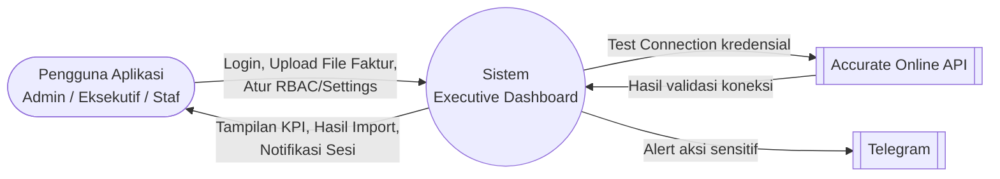
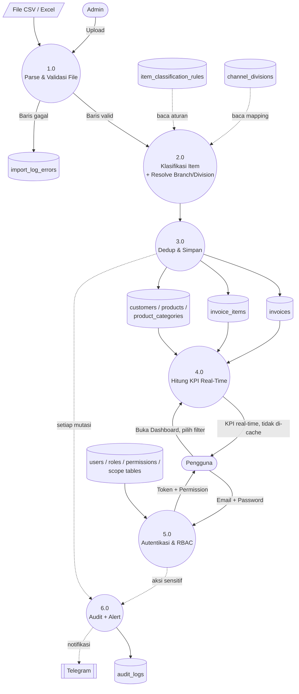

# Executive Dashboard — Dokumentasi Produk & Panduan Penggunaan

> Dokumen ini merangkum **seluruh kapabilitas** Executive Dashboard — dari sistem keamanan tingkat enterprise, manajemen akses dinamis, hingga modul-modul analitik bisnis yang jadi andalan aplikasi. Ditulis sebagai bahan presentasi ke stakeholder sekaligus panduan penggunaan sehari-hari.

---

## Daftar Isi

1. [Ringkasan Eksekutif](#1-ringkasan-eksekutif)
2. [Keamanan Tingkat Enterprise](#2-keamanan-tingkat-enterprise)
3. [Manajemen Akses Dinamis (RBAC)](#3-manajemen-akses-dinamis-rbac)
4. [Personalisasi Pengguna](#4-personalisasi-pengguna)
5. [Modul & Fitur Andalan](#5-modul--fitur-andalan)
6. [Metodologi Perhitungan KPI](#6-metodologi-perhitungan-kpi)
7. [Import Data & Integrasi](#7-import-data--integrasi)
8. [Audit Trail](#8-audit-trail)
9. [Aplikasi Mobile (PWA)](#9-aplikasi-mobile-pwa)
10. [Arsitektur Data](#10-arsitektur-data)

---

## 1. Ringkasan Eksekutif

**Executive Dashboard** adalah platform business intelligence untuk perusahaan holding dengan banyak entitas — mengubah data faktur penjualan mentah menjadi **10 indikator kinerja (KPI)** siap pakai, dengan sistem akses berlapis yang memastikan setiap orang di organisasi hanya melihat data yang memang jadi kewenangannya.

**Cakupan yang sudah dibangun:**

| Area | Cakupan |
|---|---|
| Modul analitik bisnis | 4 workbench (Executive Dashboard, Customer, Product & Portfolio, Transaction & Revenue) — 10 halaman KPI aktif |
| Indikator kinerja | 10 KPI (M1–M10), dihitung real-time dari data transaksi, bukan angka statis |
| Keamanan | 7 lapis proteksi berbeda — rate limiting, account lockout, invalidasi sesi otomatis, notifikasi real-time, security headers, CORS, audit trail penuh |
| Manajemen akses | RBAC dinamis — 88 permission granular di 24 kategori, plus hierarki isolasi data 3 tingkat (Company → Branch → Division) |
| Personalisasi | 2 bahasa penuh, mode terang/gelap, 6 pilihan warna aksen — semua tersimpan ke akun |
| Import data | 4 jalur import (faktur, channel division, klasifikasi item, user), dengan mesin klasifikasi otomatis 4-lapis |
| Platform | Progressive Web App — bisa di-install seperti aplikasi native di HP/desktop tanpa app store |

**Alur bisnis inti:**

```
Admin import faktur (upload file Excel/CSV)
        ↓
Sistem parse, validasi, klasifikasi otomatis, dan simpan ke database
        ↓
Sistem hitung 10 KPI secara real-time (bukan cache statis)
        ↓
Setiap pengguna melihat dashboard sesuai hak akses & scope data masing-masing
```

**Teknologi yang dipakai** (untuk kredibilitas teknis): backend Bun + Hono + PostgreSQL, frontend React 19 + TypeScript + MUI. Seluruh perhitungan KPI dilakukan di server, bukan di browser — memastikan konsistensi angka di mana pun diakses.

---

## 2. Keamanan Tingkat Enterprise

Aplikasi ini dibangun dengan standar keamanan berlapis — bukan sekadar login-password biasa, tapi rangkaian proteksi yang lazim dipakai aplikasi finansial/perbankan skala menengah-besar.

### 2.1 Autentikasi & Manajemen Sesi

- Token akses (JWT) berumur pendek (15 menit) + token refresh (7 hari), keduanya disimpan sebagai cookie `httpOnly` — **tidak bisa dicuri lewat serangan JavaScript/XSS** karena browser sendiri yang mengunci aksesnya dari script halaman.
- Setiap aksi yang mengubah data wajib menyertakan token CSRF — mencegah situs pihak ketiga menyamar mengirim request atas nama pengguna yang sedang login.
- Password di-hash dengan algoritma bcrypt (cost factor 12) — bahkan admin sistem tidak bisa melihat password asli siapa pun.

### 2.2 Pembatasan Percobaan (Rate Limiting)

Setiap endpoint sensitif dibatasi jumlah percobaan dalam jendela waktu tertentu untuk mencegah serangan brute-force dan penyalahgunaan otomatis:

| Aksi | Batas | Jendela | Dihitung Per |
|---|---|---|---|
| Login | 10x | 15 menit | Alamat IP |
| Refresh token | 30x | 15 menit | Alamat IP |
| Ubah preferensi akun | 20x | 5 menit | Akun |
| Mutasi data User | 30x | 5 menit | Akun |
| Mutasi Role/Permission | 20x | 5 menit | Akun |
| Mutasi Company/Branch | 15x | 5 menit | Akun |
| Mutasi Channel Division | 20x | 5 menit | Akun |
| Mutasi Klasifikasi Item | 20x | 5 menit | Akun |
| Mutasi Produk High Margin | 20x | 5 menit | Akun |
| Mutasi Page/Feature Settings | 20x | 5 menit | Akun |
| Mutasi Business Config | 20x | 5 menit | Akun |
| Simpan kredensial Accurate | 15x | 5 menit | Akun |
| Test koneksi Accurate | 10x | 5 menit | Akun |
| Import file | 5x | 10 menit | Akun |

### 2.3 Penguncian Akun Otomatis (Account Lockout)

Lapisan kedua di atas rate-limit IP — mengunci **akun spesifik** setelah **5 kali gagal login berturut-turut**, terkunci selama **30 menit** (kedua angka ini dikonfigurasi lewat environment variable, bukan hardcode — bisa disesuaikan kapan saja tanpa deploy ulang). Selama terkunci, password yang benar sekalipun tetap ditolak. Admin bisa membuka kunci manual dari halaman Users.

### 2.4 Invalidasi Sesi Otomatis

Kalau admin mereset password seorang user, **seluruh sesi aktif user itu di semua perangkat langsung tidak valid** — bukan menunggu token kedaluwarsa secara alami. Krusial untuk skenario akun dicurigai kompromis: begitu password direset, akses attacker (kalau ada) langsung terputus instan.

### 2.5 Notifikasi Keamanan Real-Time

Sistem terintegrasi dengan **Telegram** untuk mengirim notifikasi instan saat terjadi aksi berisiko tinggi:

- Akun terkunci (indikasi percobaan serangan)
- Peningkatan hak akses — user baru diberi role admin/superadmin, atau permission Access Control di-assign ke role manapun
- Aksi destruktif — penghapusan akun admin atau role
- Reset password ke akun admin/superadmin
- Pembukaan kunci akun manual

Tim keamanan/IT mendapat visibilitas real-time tanpa perlu memeriksa log secara manual.

### 2.6 Perlindungan Tingkat Jaringan

- **CORS** — hanya domain yang di-whitelist eksplisit yang boleh memanggil API, bukan akses terbuka.
- **Security Headers** — `X-Frame-Options: DENY` (anti-clickjacking), `X-Content-Type-Options: nosniff`, `Strict-Transport-Security` (paksa HTTPS di production), `Referrer-Policy: no-referrer`.
- Error server **tidak pernah** membocorkan stack trace atau detail teknis internal ke pengguna.

### 2.7 Audit Trail Menyeluruh

Lihat bagian [§8 Audit Trail](#8-audit-trail).

---

## 3. Manajemen Akses Dinamis (RBAC)

Sistem hak akses di aplikasi ini **sepenuhnya dinamis** — dikelola langsung dari dashboard admin, tanpa perlu sentuh baris kode apa pun untuk menambah role atau mengubah kewenangan.

### 3.1 Dua Sumbu Akses yang Independen

| Sumbu | Menjawab | Diatur di |
|---|---|---|
| **Permission (Role)** | "Boleh melakukan APA?" | Halaman RBAC |
| **Scope (Company/Branch/Division)** | "Boleh lihat data SIAPA/MANA?" | Halaman Users |

Dua user dengan role identik tetap bisa melihat data yang sama sekali berbeda kalau scope mereka berbeda — dan sebaliknya. Analoginya: **Permission = jabatan/wewenang**, **Scope = wilayah kerja**.

### 3.2 Skala Granularitas

**88 permission** tersebar di **24 kategori** — mencakup seluruh modul aplikasi (Dashboard, Customer, Product, Transaction, Settings, Configuration, Access Control, Audit Log). Setiap halaman punya permission `:menu` (visibilitas di sidebar) terpisah dari permission aksi (`:view`/`:create`/`:update`/`:delete`/`:export`) — jadi kontrolnya sangat presisi, bukan cuma "boleh akses halaman ini atau tidak".

Contoh: user bisa diberi akses membuka menu Customer tapi tanpa hak Export — tombol Export otomatis tidak akan pernah muncul di layarnya, dan permintaan langsung ke server pun akan ditolak (validasi dobel: tampilan DAN backend).

### 3.3 Role Bawaan

| Role | Cakupan |
|---|---|
| **Super Admin** | Akses penuh tanpa kecuali, termasuk Configuration (Integrasi Accurate, Feature Flags) yang eksklusif untuknya |
| **Admin** | Akses penuh ke seluruh modul bisnis inti; di Administration terbatas view+update saja (tanpa create/delete), Configuration tidak bisa diakses sama sekali |
| **User** | View + export saja di modul bisnis inti, tanpa akses Administration |

Ketiganya bisa disesuaikan sepenuhnya, atau dibuat role custom baru sesuai struktur organisasi (contoh: "Sales Manager Cabang Jakarta" dengan kombinasi permission spesifik).

### 3.4 Hierarki Isolasi Data 3 Tingkat

```
Company (Perusahaan/Entitas)
   └── Branch (Cabang)
          └── Division (Divisi/Channel bisnis)
```

Akses berjenjang — harus punya akses Company dulu sebelum bisa diberi akses Branch di dalamnya, dan seterusnya. User tanpa akses eksplisit ke suatu Company/Branch/Division **tidak akan melihat data apa pun dari situ** (default deny, bukan default allow). Super Admin melewati seluruh pembatasan ini.

Data milik akun Super Admin sendiri (di daftar User maupun Audit Log) **disembunyikan total** dari siapa pun yang bukan Super Admin — lapisan privasi tambahan di level tertinggi organisasi.

### 3.5 Daftar Lengkap 24 Kategori Permission

| Kategori | Prefix Key | Aksi yang Tersedia |
|---|---|---|
| Dashboard | `dashboard` | menu, view |
| Customer | `customer` | menu, view, export |
| Expansion Targets | `expansion` | menu, view, export |
| Churn Risk | `churn.risk` | menu, view, export |
| Cross Selling | `cross.selling` | menu, view, export |
| Product | `product` | menu, view, export |
| High Margin | `high.margin` | menu, view, export |
| Product Trend | `product.trend` | menu, view, export |
| Transaction | `transaction` | menu, view, export |
| Project | `project` | menu, view |
| App Settings | `settings.app` | menu, view, update |
| Company | `settings.company` | menu, view, create, update, delete |
| Branch | `settings.branch` | view, create, update, delete |
| Channel Division | `settings.channel.division` | menu, view, create, update, delete |
| Product Settings | `settings.product` | menu, view, create, update, delete |
| Threshold | `settings.threshold` | menu, view, update |
| Classification | `config.classification` | menu, view, create, update, delete |
| Import | `config.import` | menu, view, import |
| Integration | `config.integration` | menu, view, create, update, test, reset |
| Features | `config.features` | menu, view, update |
| Users | `access.user` | menu, view, create, update, delete, unlock |
| Roles | `access.role` | menu, view, create, update, delete |
| Permissions | `access.permission` | view, update |
| Audit Log | `audit.log` | menu, view, export |

### 3.6 Cara Kerja Pemberian Akses

Membuat role baru dan mengatur kewenangannya hanya butuh beberapa klik dari halaman RBAC — tanpa sentuh kode:

1. Klik **Add Role**, isi nama & deskripsi (contoh: "Sales Manager Cabang").
2. Klik ikon perisai **Assign Permissions** — terbuka dialog matrix checklist per kategori, kolom aksi otomatis menyesuaikan permission yang tersedia untuk kategori itu.
3. Centang kombinasi yang diinginkan, simpan.
4. Dari halaman Users, assign role tadi ke pengguna, sekaligus tentukan scope Company/Branch/Division-nya secara berjenjang.

Seluruh proses ini live — begitu disimpan, langsung berlaku di request berikutnya, tanpa perlu restart aplikasi atau deploy ulang.

---

## 4. Personalisasi Pengguna

Setiap pengguna bisa menyesuaikan tampilan sesuai preferensi pribadi, **tersimpan ke akun** (bukan hanya di satu browser) — konsisten di perangkat mana pun mereka login:

- **Bahasa:** Indonesia / English — 100% cakupan, tidak ada teks yang belum diterjemahkan
- **Tema:** Terang / Gelap, dengan animasi transisi melingkar yang halus
- **Warna aksen:** 6 pilihan (Biru, Hijau, Kuning, Ungu, Merah Muda, Indigo) — memengaruhi warna tombol, judul halaman, dan AppBar di seluruh aplikasi

---

## 5. Modul & Fitur Andalan

Bagian ini adalah inti dari apa yang dilihat dan dipakai pengguna sehari-hari — dijelaskan mendalam per halaman, termasuk data apa yang disajikan dan interaksi drill-down yang tersedia.

### 5.1 Executive Dashboard — Ringkasan Sekali Pandang

Halaman pertama setelah login. Menyajikan **seluruh 10 KPI dalam satu layar**, tanpa perlu berpindah-pindah halaman untuk mendapat gambaran menyeluruh kondisi bisnis.

**Baris pertama** — 10 kartu ringkas, satu per KPI: nilai terkini, indikator naik/turun dibanding periode sebelumnya, dan grafik mini tren. **Baris kedua** — 8 grafik lebih besar yang memvisualisasikan KPI utama dengan jenis chart yang disesuaikan karakter datanya (batang, area, donat, radial, garis dengan zona alert, bullet chart). **Setiap kartu dan grafik bisa diklik** untuk langsung membuka halaman detail KPI terkait.

| KPI | Yang Diukur | Cara Baca |
|---|---|---|
| Cross Selling Ratio | % pelanggan aktif yang beli >1 kategori sekaligus | Makin tinggi = pelanggan makin "lengket", peluang bundling makin besar |
| Avg Category per Customer | Rata-rata jenis kategori dibeli per pelanggan | Mendekati 1 = pelanggan cenderung monoton beli 1 jenis produk |
| Avg Revenue Existing Customer | Rata-rata pendapatan per pelanggan lama aktif | Tren turun = sinyal awal pelanggan lama mengurangi belanja |
| Avg Gross Profit Existing Customer | Sama seperti di atas, dari sisi laba, dipecah 3 tingkat (Atas/Tengah/Bawah) | Porsi "Tier Bawah" membesar = margin sedang tertekan |
| High Margin Penetration | % pelanggan lama yang beli produk margin tinggi | Rendah = peluang upsell margin tinggi belum tergarap |
| Repeat Order Rate | % pelanggan lama yang order >1x dalam 30 hari | Hijau = capai target, Merah = jauh di bawah target |
| Customer Expansion Rate | % pelanggan lama yang belanjanya NAIK | Tinggi = pertumbuhan organik dari pelanggan existing |
| Dormant Customer Rate | % dari SELURUH pelanggan yang 90 hari tanpa transaksi | Ada garis ambang batas — lewati itu, perlu perhatian khusus |
| Dormant Customer Value | Estimasi rupiah "hilang" per pelanggan dormant | Diurutkan dari kerugian terbesar — prioritas follow-up |
| Customer Reactivation Rate | % pelanggan dormant yang berhasil "dibangunkan" | Target minimum 15–20% |

### 5.2 Customer Workbench — Analisis Mendalam Seputar Pelanggan

#### Customer — Profil 360° Pelanggan

Daftar master seluruh pelanggan dengan kolom: kode, nama, perusahaan, divisi, status (Aktif/Existing/Dormant/New), jumlah kategori produk, rata-rata belanja bulanan, lifetime value, tanggal transaksi terakhir, dan total faktur. Bisa dicari berdasarkan nama/kode.

**Klik satu pelanggan** membuka dialog profil lengkap — bukan sekadar ringkasan, tapi gambaran 360° dalam satu tampilan:
- Identitas, status, dan divisi (dalam bentuk chip berwarna)
- 4 kotak metrik ringkas: Lifetime Value, Rata-rata Revenue Bulanan, Jumlah Kategori, Total Faktur
- Daftar seluruh kategori produk yang pernah dibeli
- **Grafik kombinasi tren revenue vs gross profit bulanan** — melihat pola profitabilitas pelanggan dari waktu ke waktu
- Daftar faktur terbaru (nomor, tanggal, revenue, GP per faktur)

Semua ini didapat tanpa perlu berpindah halaman — cocok untuk tim sales/account manager yang butuh gambaran cepat sebelum menghubungi pelanggan.

#### Expansion Targets — Pertumbuhan Pelanggan Existing (M3–M7)

5 metrik: Avg Revenue, Avg Gross Profit (dengan breakdown tier), High Margin Penetration, Repeat Order Rate, Customer Expansion Rate.

**Fitur drill-down unggulan:**
- **Klik batang bulan pada grafik Gross Profit** → modal breakdown lengkap: ringkasan GP existing customer, total existing, avg GP/customer, dan **threshold median** yang dipakai untuk membagi 3 tier. Tabel ranking lengkap per pelanggan (nama, kode, GP, % kontribusi, tier) dengan chip warna berbeda per tier. **Tombol export PDF langsung tersedia** — sekali klik menghasilkan laporan siap kirim ke manajemen.
- **Klik grafik radial Repeat Order Rate** → modal breakdown: total existing, jumlah repeat buyer, dan rate keseluruhan. Tabel ranking pelanggan dengan chip jumlah order (warna berjenjang sesuai frekuensi — makin sering order, makin mencolok warnanya) dan total revenue per pelanggan — langsung terlihat siapa pelanggan paling loyal.
- Kalau ada 1 pelanggan yang menyumbang lebih dari 25% total revenue/GP bulan itu, **muncul tanda peringatan otomatis** di grafik — sinyal dini risiko konsentrasi pelanggan.

#### Churn Risk — Deteksi Dini Pelanggan Berisiko (M8–M10)

3 metrik: Dormant Rate (dengan garis ambang batas kritis), Dormant Value (ranking horizontal pelanggan dengan potensi kerugian terbesar — langsung terlihat prioritas follow-up tanpa perlu menghitung manual), dan Reactivation Rate (seberapa efektif upaya "membangunkan" pelanggan dormant, ditampilkan sebagai bullet chart terhadap target).

#### Cross Sell Matrix — Pola Pembelian Silang (M1–M2)

2 metrik ringkas (Cross Selling Ratio, Avg Category per Customer) dilengkapi **heatmap Customer × Kategori Produk** — visualisasi matrix yang langsung menunjukkan pola kombinasi pembelian mana yang paling sering muncul, dasar kuat untuk merancang strategi bundling produk. Di bawah heatmap, tabel detail per pelanggan menunjukkan kepemilikan tiap kategori (Unit/Consumable/Sparepart) dalam bentuk chip Ya/Tidak, plus jumlah kategori total dan revenue.

### 5.3 Product & Portfolio — Kinerja Produk

#### Product Ledger

Daftar seluruh kategori produk berikut performanya: status high-margin, total revenue, total GP, margin %, jumlah pelanggan pembeli, jumlah transaksi, dan bulan terakhir terjual — default terurut dari revenue tertinggi.

**Klik satu kategori** membuka detail lengkap: badge status (High Margin/Service bila relevan), 6 kotak ringkasan (Total Revenue, Total GP, Margin %, Jumlah Invoice, Jumlah Customer, Bulan Terakhir Terjual), dan tabel seluruh produk di dalam kategori itu (nama, revenue, GP, margin % dengan chip warna sesuai tingkat margin, jumlah invoice, jumlah customer unik) — memetakan produk mana yang jadi kontributor utama dalam satu kategori.

#### High Margin Push — Mesin Upsell

Dua tab kerja: **Category Penetration** (persentase pelanggan existing yang sudah membeli tiap kategori high-margin) dan **Upsell Targets** — daftar pelanggan yang BELUM membeli kategori high-margin tertentu, siap jadi target langsung tim sales.

**Klik target upsell** membuka riwayat lengkap pembelian pelanggan itu: rata-rata revenue/bulan, tanggal transaksi terakhir, dan tabel seluruh produk yang pernah dibeli (kategori, nama produk, revenue, GP, margin % berwarna, jumlah invoice) — bisa difilter ke satu kategori spesifik. Tim sales bisa langsung tahu apa yang sudah dibeli pelanggan sebelum menawarkan produk margin tinggi tambahan yang relevan.

#### Product Trend

Tren rata-rata jumlah kategori yang dibeli per pelanggan dari waktu ke waktu — indikator apakah pola belanja pelanggan makin bervariasi (bagus) atau makin sempit (perlu perhatian).

### 5.4 Transaction & Revenue — Buku Besar Transaksi

#### Transaction Ledger

Catatan lengkap seluruh faktur: nomor, tanggal, perusahaan, pelanggan, divisi/channel, total revenue, total GP, margin %, jumlah kategori dalam faktur, dan sumber data (upload manual atau sinkron Accurate) — bisa difilter Company/Branch/Division/periode seperti modul lain, jadi satu sumber kebenaran (single source of truth) untuk seluruh riwayat transaksi holding.

---

## 6. Metodologi Perhitungan KPI

Seluruh 10 KPI dihitung **real-time di server** langsung dari data faktur — tidak ada angka "beku"/cache lama. Status pelanggan (Aktif/Existing/Dormant/New) selalu dihitung relatif terhadap tanggal yang dipilih, dengan window 30 hari rolling untuk "aktif" dan 90 hari untuk "dormant".

| KPI | Formula Inti |
|---|---|
| **M1** Cross Selling Ratio | Pelanggan aktif dengan ≥2 kategori berbeda ÷ Total pelanggan aktif |
| **M2** Avg Category/Customer | Total kategori unik terjual ÷ Jumlah pelanggan aktif |
| **M3** Avg Revenue/Customer | Total revenue existing yang transaksi ÷ Jumlah existing yang transaksi |
| **M4** Avg GP/Customer | Total GP existing yang transaksi ÷ Jumlah existing yang transaksi, dipecah 3 tier berbasis median |
| **M5** High Margin Penetration | Existing pembeli produk high-margin ÷ TOTAL existing (termasuk yang tidak transaksi) |
| **M6** Repeat Order Rate | Existing dengan ≥2 invoice dalam 30 hari ÷ TOTAL existing |
| **M7** Customer Expansion Rate | Existing dengan revenue naik vs 30 hari sebelumnya ÷ TOTAL existing |
| **M8** Dormant Customer Rate | Pelanggan >90 hari tanpa transaksi ÷ SELURUH pelanggan |
| **M9** Dormant Customer Value | Rata-rata revenue bulanan historis × jumlah bulan dormant |
| **M10** Reactivation Rate | Dormant periode lalu yang kembali transaksi ÷ Total dormant periode lalu |

Produk "high-margin" (dipakai M5) ditentukan **otomatis dari data** — margin rate aktual tiap produk dihitung tiap bulan, lalu dibandingkan terhadap threshold (median otomatis, atau nilai tetap yang bisa diatur admin di Settings → Threshold). Target KPI (M6, M8, M10) juga bisa dikustomisasi admin tanpa perlu update aplikasi.

---

## 7. Import Data & Integrasi

### 7.1 Empat Jalur Import Terpusat

Satu halaman Import menangani 4 jenis data: **Faktur** (sumber utama seluruh KPI), **Channel Divisions** (mapping channel penjualan ke divisi bisnis), **Klasifikasi Item** (aturan otomatis jenis barang), dan **User Baru** (bulk-create akun). Setiap jenis dilengkapi **tombol Download Template** — file siap pakai dengan deskripsi kolom dan contoh data, cara paling efektif mencegah kesalahan format saat upload.

### 7.2 Mesin Klasifikasi Otomatis 4-Lapis

Setiap item faktur diklasifikasikan otomatis ke 4 tipe (unit/consumable/sparepart/service) lewat rule engine bertingkat: kata kunci nama item → kata kunci kategori → rentang harga → fallback. Parser juga toleran terhadap variasi nama kolom (Indonesia/Inggris) dan mendeteksi header secara dinamis, sehingga proses import tetap lancar meski format file sedikit bervariasi.

### 7.3 Integrasi Accurate Online

Kredensial API tersimpan **terenkripsi** (AES-256-GCM), lengkap dengan fitur Test Connection untuk validasi sebelum dipakai. *(Catatan transparansi: fitur sinkronisasi otomatis data faktur langsung dari Accurate masih dalam tahap pengembangan — alur kerja saat ini tetap export manual dari Accurate lalu upload lewat halaman Import.)*

---

## 8. Audit Trail

Setiap aksi yang mengubah data (tambah/ubah/hapus) di seluruh aplikasi **otomatis tercatat permanen** — tidak bisa diubah atau dihapus siapa pun lewat aplikasi. Setiap entry mencatat: pelaku, jenis aksi, data sebelum & sesudah perubahan, konteks perusahaan, alamat IP, dan waktu kejadian — dapat difilter dan ditelusuri kapan saja lewat halaman Audit Log. Fondasi penting untuk kepatuhan (compliance) dan investigasi insiden.

---

## 9. Aplikasi Mobile (PWA)

Aplikasi bisa **di-install** ke homescreen HP maupun desktop layaknya aplikasi native — tanpa App Store/Play Store. Berjalan standalone (tanpa address bar browser), tampilan otomatis menyesuaikan antara mode desktop (tabel penuh) dan mobile (tampilan kartu). Data selalu diambil fresh dari server — tidak pernah menampilkan angka KPI dari cache lama, memastikan akurasi real-time bahkan dalam mode aplikasi terinstal.

---

## 10. Arsitektur Data

Diagram berikut ditulis dalam sintaks **Mermaid** — otomatis tampil sebagai gambar di GitHub, GitLab, dan editor Markdown modern. Kalau viewer tidak mendukung, salin ke [mermaid.live](https://mermaid.live) untuk melihat hasilnya.

### 10.1 Diagram Konteks (DFD Level 0)



### 10.2 Proses Utama (DFD Level 1)



### 10.3 ERD — Data Transaksi & Master

```mermaid
erDiagram
    COMPANIES ||--o{ COMPANY_BRANCHES : memiliki
    COMPANIES ||--o{ CUSTOMERS : memiliki
    COMPANIES ||--o{ PRODUCTS : memiliki
    COMPANIES ||--o{ INVOICES : memiliki
    COMPANY_BRANCHES ||--o{ INVOICES : "lokasi transaksi"
    CUSTOMERS ||--o{ INVOICES : melakukan
    PRODUCT_CATEGORIES ||--o{ PRODUCTS : mengelompokkan
    PRODUCT_CATEGORIES ||--o{ INVOICE_ITEMS : mengelompokkan
    PRODUCTS ||--o{ INVOICE_ITEMS : terjual
    INVOICES ||--o{ INVOICE_ITEMS : terdiri_dari
    IMPORT_LOGS ||--o{ INVOICES : menghasilkan

    COMPANIES { int id PK, varchar code UK, varchar name }
    COMPANY_BRANCHES { int id PK, int company_id FK, varchar name }
    CUSTOMERS { int id PK, int company_id FK, varchar customer_code, varchar customer_name }
    PRODUCT_CATEGORIES { int id PK, int company_id FK, varchar name, varchar item_type }
    PRODUCTS { int id PK, int company_id FK, varchar product_name, int product_category_id FK }
    INVOICES { int id PK, int company_id FK, int customer_id FK, int branch_id FK, varchar invoice_number UK, date invoice_date, numeric total_revenue, numeric total_gp }
    INVOICE_ITEMS { int id PK, int invoice_id FK, int product_id FK, numeric revenue, numeric gross_profit }
    IMPORT_LOGS { int id PK, int company_id FK, varchar source, varchar status }
```

### 10.4 ERD — Akses & Keamanan (RBAC)

```mermaid
erDiagram
    USERS ||--o{ USER_ROLES : memiliki
    ROLES ||--o{ USER_ROLES : "di-assign ke"
    ROLES ||--o{ ROLE_PERMISSIONS : memiliki
    PERMISSIONS ||--o{ ROLE_PERMISSIONS : "di-assign ke"
    USERS ||--o{ USER_COMPANIES : "scope company"
    COMPANIES ||--o{ USER_COMPANIES : "diakses oleh"
    USERS ||--o{ USER_BRANCHES : "scope branch"
    COMPANY_BRANCHES ||--o{ USER_BRANCHES : "diakses oleh"
    USERS ||--o{ USER_DIVISIONS : "scope division"
    USERS ||--o{ AUDIT_LOGS : melakukan

    USERS { int id PK, varchar name, varchar email UK, boolean is_active, int failed_login_count, timestamp locked_until, int token_version }
    ROLES { int id PK, varchar name UK, boolean is_system }
    PERMISSIONS { int id PK, varchar name UK, varchar category }
    AUDIT_LOGS { int id PK, int actor_id FK, varchar action, varchar entity, jsonb old_value, jsonb new_value, varchar ip_address }
```

**Cara membaca notasi relasi:** `||--o{` berarti "satu wajib ke nol-atau-banyak".

---

## Ringkasan Pencapaian

Executive Dashboard dibangun sebagai platform business intelligence yang tidak berhenti di "menampilkan angka" — tapi memberi konteks, keamanan, dan kontrol akses setara aplikasi enterprise:

- **10 KPI real-time**, dihitung langsung dari data transaksi, bukan laporan statis bulanan.
- **7 lapis pertahanan keamanan** berjalan simultan — rate limiting, account lockout, invalidasi sesi otomatis, notifikasi real-time, security headers, CORS, dan audit trail penuh.
- **RBAC dinamis** dengan 88 permission granular dan hierarki isolasi data 3 tingkat — struktur akses yang bisa mengikuti organisasi seluas apa pun tanpa perlu developer turun tangan tiap kali ada perubahan struktur.
- **Drill-down di hampir setiap grafik** — dari angka ringkasan sampai ke daftar pelanggan/produk individual, lengkap dengan export PDF di titik-titik yang paling dibutuhkan (breakdown Gross Profit).
- **Progressive Web App** — pengalaman aplikasi native tanpa biaya/kerumitan distribusi lewat app store.

Dokumen ini akan terus diperbarui seiring pengembangan fitur baru.
