# Executive Dashboard — Panduan Penggunaan

> Petunjuk penggunaan aplikasi Executive Dashboard — mencakup login, keamanan, manajemen akses, pengaturan, cara pakai tiap menu KPI dari awal sampai akhir beserta dasar perhitungannya, cara import data, dan diagram arsitektur data. Setiap bagian disertai screenshot langsung dari aplikasi.

---

## Daftar Isi

1. [Login dan Orientasi Awal](#1-login-dan-orientasi-awal)
2. [Keamanan Aplikasi](#2-keamanan-aplikasi)
3. [Manajemen Akses (RBAC)](#3-manajemen-akses-rbac)
4. [Isolasi Data — Company, Branch, Division](#4-isolasi-data--company-branch-division)
5. [Pengaturan Aplikasi](#5-pengaturan-aplikasi)
6. [Dashboard — Halaman Utama](#6-dashboard--halaman-utama)
7. [Customer Workbench](#7-customer-workbench)
8. [Product & Portfolio](#8-product--portfolio)
9. [Transaction & Revenue](#9-transaction--revenue)
10. [Import Data](#10-import-data)
11. [Audit Log](#11-audit-log)
12. [Aplikasi Mobile (PWA)](#12-aplikasi-mobile-pwa)
13. [Diagram Arsitektur Data](#13-diagram-arsitektur-data)

---

## 1. Login dan Orientasi Awal

Buka aplikasi di browser, masukkan email dan password.


Setelah login, tampilan utama terdiri dari:

| Bagian | Isi |
|---|---|
| Sidebar (kiri) | Daftar menu, dikelompokkan per grup: Executive Dashboard, Customer Workbench, Product & Portfolio, Transaction & Revenue, Administration. Bisa diciutkan jadi ikon lewat tombol hamburger di pojok kiri atas. |
| AppBar (atas) | Nama aplikasi, tombol ganti tema terang/gelap, avatar akun di pojok kanan. |
| Avatar (kanan atas) | Klik untuk lihat profil (nama, email, Company/Branch/Division yang diakses) dan tombol Logout. |

Menu yang muncul di sidebar berbeda per akun, tergantung permission yang di-assign (lihat §3).

---

## 2. Keamanan Aplikasi

### 2.1 Autentikasi dan Sesi

Login menghasilkan dua token: **access token** (berlaku 15 menit) dan **refresh token** (berlaku 7 hari). Keduanya disimpan sebagai cookie `httpOnly`, artinya tidak bisa diakses lewat JavaScript di browser. Access token yang kedaluwarsa di-refresh otomatis di background menggunakan refresh token, tanpa perlu login ulang.

Setiap request yang mengubah data (create/update/delete) wajib menyertakan token CSRF (`X-CSRF-Token`). Password disimpan dalam bentuk hash bcrypt (cost factor 12) — password asli tidak pernah tersimpan dalam bentuk terbuka.

### 2.2 Pembatasan Percobaan (Rate Limiting)

Setiap endpoint sensitif dibatasi jumlah percobaan dalam jendela waktu tertentu. Kalau limit terlampaui, request ditolak dengan kode HTTP 429.

| Aksi | Batas | Jendela | Dihitung Per |
|---|---|---|---|
| Login | 10x | 15 menit | Alamat IP |
| Refresh token | 30x | 15 menit | Alamat IP |
| Ubah preferensi akun | 20x | 5 menit | Akun |
| Mutasi data User | 30x | 5 menit | Akun |
| Mutasi Role/Permission | 20x | 5 menit | Akun |
| Mutasi Company/Branch | 15x | 5 menit | Akun |
| Mutasi Channel Division | 20x | 5 menit | Akun |
| Mutasi Klasifikasi Item | 20x | 5 menit | Akun |
| Mutasi Produk High Margin | 20x | 5 menit | Akun |
| Mutasi Page/Feature Settings | 20x | 5 menit | Akun |
| Mutasi Business Config | 20x | 5 menit | Akun |
| Simpan kredensial Accurate | 15x | 5 menit | Akun |
| Test koneksi Accurate | 10x | 5 menit | Akun |
| Import file | 5x | 10 menit | Akun |

Endpoint yang hanya membaca data tidak dibatasi.

### 2.3 Penguncian Akun Otomatis

Terpisah dari rate-limit per-IP di atas, akun individual otomatis terkunci setelah **5 kali gagal login berturut-turut**, terkunci selama **30 menit**. Kedua angka ini diatur lewat environment variable di server, bisa diubah tanpa deploy ulang aplikasi. Selama terkunci, password yang benar sekalipun tetap ditolak. Login yang berhasil mereset hitungan ke nol.

Admin dengan permission `access.user:unlock` dapat membuka kunci akun secara manual dari halaman Users — muncul chip status "Terkunci" pada baris user yang terkunci beserta tombol untuk membukanya.

### 2.4 Invalidasi Sesi Otomatis

Kalau admin mereset password seorang user, seluruh sesi aktif user itu di semua perangkat langsung menjadi tidak valid — user akan diminta login ulang di request berikutnya, tanpa menunggu token kedaluwarsa secara alami.

### 2.5 Notifikasi ke Telegram

Sistem mengirim notifikasi ke channel Telegram saat terjadi:

1. Akun terkunci (5x gagal login berturut-turut)
2. User baru dibuat dengan role admin/superadmin, atau user existing baru diberi role tersebut
3. Permission kategori Access Control (Users/Roles/Permissions) di-assign ke role apa pun
4. Penghapusan akun admin atau penghapusan role
5. Reset password ke akun admin/superadmin
6. Pembukaan kunci akun manual oleh admin

### 2.6 Proteksi Tingkat Jaringan

- **CORS** — hanya domain yang di-whitelist eksplisit di environment variable yang bisa memanggil API.
- **Security headers** — `X-Frame-Options: DENY` (halaman tidak bisa disisipkan ke iframe situs lain), `X-Content-Type-Options: nosniff`, `Strict-Transport-Security` (memaksa HTTPS, aktif di production), `Referrer-Policy: no-referrer`.
- Error server tidak pernah menampilkan stack trace ke pengguna.

---

## 3. Manajemen Akses (RBAC)

Sistem permission diatur dari dashboard, tanpa perlu ubah kode program.

### 3.1 Dua Sumbu Akses

| Sumbu | Menjawab | Diatur di |
|---|---|---|
| Permission (Role) | Boleh melakukan apa | Halaman RBAC |
| Scope (Company/Branch/Division) | Boleh lihat data yang mana | Halaman Users |

Dua axis ini independen. Dua user dengan role sama bisa melihat data berbeda kalau scope-nya berbeda, dan sebaliknya.

### 3.2 Halaman RBAC (Roles)

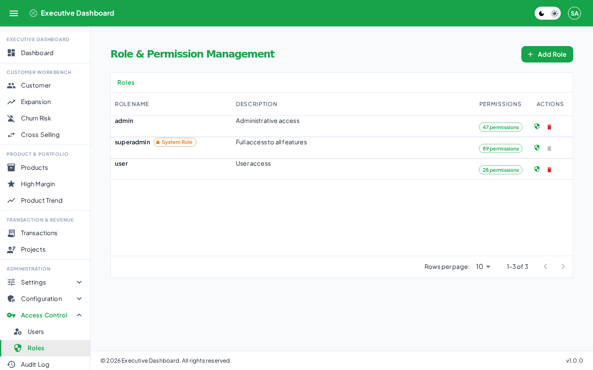

Daftar role beserta jumlah permission yang dimiliki masing-masing. Role `superadmin` ditandai "System" (tidak bisa dihapus/di-rename). Role `admin` dan `user` bisa disesuaikan atau dihapus.

Klik ikon perisai pada satu role untuk membuka dialog **Set Permission**:


Dialog ini menampilkan daftar kategori (Permissions, Roles, Users, Audit Log, Churn Risk, Classification, Features, Import, Integration, Cross Selling, dst — 24 kategori total) yang bisa dicari lewat kolom filter di atas. Tiap kategori menampilkan progress (contoh: "3/3", "2/3") menunjukkan berapa dari total permission di kategori itu yang sudah aktif untuk role tersebut. Klik satu kategori untuk membuka/tutup daftar checkbox permission di dalamnya.

**Daftar lengkap 24 kategori dan aksi yang tersedia:**

| Kategori | Prefix Key | Aksi yang Tersedia |
|---|---|---|
| Dashboard | `dashboard` | menu, view |
| Customer | `customer` | menu, view, export |
| Expansion Targets | `expansion` | menu, view, export |
| Churn Risk | `churn.risk` | menu, view, export |
| Cross Selling | `cross.selling` | menu, view, export |
| Product | `product` | menu, view, export |
| High Margin | `high.margin` | menu, view, export |
| Product Trend | `product.trend` | menu, view, export |
| Transaction | `transaction` | menu, view, export |
| Project | `project` | menu, view |
| App Settings | `settings.app` | menu, view, update |
| Company | `settings.company` | menu, view, create, update, delete |
| Branch | `settings.branch` | view, create, update, delete |
| Channel Division | `settings.channel.division` | menu, view, create, update, delete |
| Product Settings | `settings.product` | menu, view, create, update, delete |
| Threshold | `settings.threshold` | menu, view, update |
| Classification | `config.classification` | menu, view, create, update, delete |
| Import | `config.import` | menu, view, import |
| Integration | `config.integration` | menu, view, create, update, test, reset |
| Features | `config.features` | menu, view, update |
| Users | `access.user` | menu, view, create, update, delete, unlock |
| Roles | `access.role` | menu, view, create, update, delete |
| Permissions | `access.permission` | view, update |
| Audit Log | `audit.log` | menu, view, export |

Setiap halaman punya permission `:menu` (menentukan tampil/tidaknya menu di sidebar) terpisah dari permission aksi (`:view`/`:create`/`:update`/`:delete`/`:export`). Contoh: kalau user diberi `customer:menu` tanpa `customer:export`, menu Customer tetap muncul dan bisa dibuka, tapi tombol Export tidak akan tampil.

**Cara membuat role baru:**
1. Klik **Add Role** di halaman RBAC, isi nama dan deskripsi.
2. Role baru dibuat tanpa permission apa pun (kosong total).
3. Klik ikon perisai role tersebut, centang kombinasi permission yang diperlukan.
4. Klik **Done**.

### 3.3 Halaman Users


Daftar seluruh pengguna: nama, email, role, daftar Company yang diakses (chip), status (Active/Terkunci), dan waktu login terakhir. Kolom "Actions" berisi menu untuk edit, reset password, kunci/buka-kunci akun, dan hapus (sesuai permission yang dimiliki viewer).

**Cara assign akses ke user:**
1. Klik **Add User** atau pilih Edit pada user existing.
2. Pilih Role (menentukan sumbu Permission, lihat §3.1).
3. Pilih Company, lalu Branch di dalam Company itu, lalu Division di dalam Branch itu — berjenjang (menentukan sumbu Scope). Satu user bisa diberi lebih dari satu kombinasi Company/Branch/Division.

---

## 4. Isolasi Data — Company, Branch, Division

Data ditata dalam 3 tingkat hierarki:

```
Company (Perusahaan/Entitas)
   └── Branch (Cabang)
          └── Division (Divisi/Channel bisnis)
```

Akses berjenjang: user harus diberi akses ke sebuah Company dulu sebelum bisa diberi akses ke Branch di dalamnya, dan harus punya akses Branch dulu sebelum bisa diberi akses Division di dalam branch itu. User tanpa akses eksplisit ke suatu Company/Branch/Division tidak akan melihat data apa pun dari situ — defaultnya adalah tidak bisa lihat, bukan bisa lihat semua.

Super Admin melewati seluruh pembatasan ini dan selalu melihat semua data.

Data milik akun Super Admin sendiri (di daftar User maupun Audit Log) disembunyikan dari siapa pun yang bukan Super Admin, walaupun role itu punya permission `access.user:view`/`audit.log:view`.

Filter Company/Branch/Division muncul di hampir semua halaman data — opsi yang tampil di dropdown filter sudah disaring sesuai scope akses user yang sedang login.

---

## 5. Pengaturan Aplikasi

Halaman **Administration → Settings → App Settings**:


| Pengaturan | Pilihan |
|---|---|
| Bahasa | Indonesia / English |
| Tema | Terang / Gelap |
| Warna aksen | Biru, Hijau, Kuning, Ungu, Merah Muda, Indigo (6 pilihan) |

Semua pilihan tersimpan ke akun (bukan hanya di satu browser) — tetap sama walau login dari perangkat lain. Warna aksen memengaruhi warna tombol, judul halaman, dan AppBar. Warna status (hijau=sukses, kuning=peringatan, merah=error) tidak berubah mengikuti palette — tetap sama di semua pilihan warna, supaya sinyal status tidak membingungkan.

---

## 6. Dashboard — Halaman Utama

Halaman pertama setelah login (menu **Dashboard**).


Filter di bagian atas (Entity, Division) menentukan cakupan data yang ditampilkan — opsi yang muncul otomatis mengikuti hak akses user. Halaman terdiri dari:

- **10 kartu ringkas** (baris pertama) — satu per KPI, menampilkan nilai saat ini, perubahan dibanding periode sebelumnya, dan grafik mini tren.
- **8 grafik** (baris berikutnya) — memvisualisasikan KPI utama dengan jenis chart yang berbeda-beda (batang, area, donat, radial, garis dengan zona ambang batas, bullet chart).

Kartu dan grafik yang punya ikon panah kecil di pojok kanan atas bisa diklik untuk membuka halaman detail KPI terkait.

| KPI | Yang Diukur |
|---|---|
| Cross Selling Ratio | Persentase pelanggan aktif yang membeli lebih dari 1 kategori produk |
| Avg Product Category | Rata-rata jumlah kategori produk yang dibeli per pelanggan aktif |
| Avg Revenue | Rata-rata pendapatan per pelanggan lama (existing) yang aktif |
| Avg Gross Profit | Rata-rata laba kotor per pelanggan lama yang aktif |
| High Margin Penetration | Persentase pelanggan lama yang membeli produk margin tinggi |
| Repeat Order Rate | Persentase pelanggan lama yang order lebih dari 1 kali dalam 30 hari |
| Customer Expansion Rate | Persentase pelanggan lama yang belanjanya naik dibanding 30 hari sebelumnya |
| Dormant Customer Rate | Persentase seluruh pelanggan yang 90 hari tanpa transaksi |
| Dormant Customer Value | Estimasi nilai rupiah yang hilang dari pelanggan dormant |
| Customer Reactivation Rate | Persentase pelanggan dormant yang kembali bertransaksi |

Definisi status pelanggan yang jadi dasar semua KPI di atas:

| Status | Kondisi |
|---|---|
| Aktif | Ada transaksi dalam 30 hari terakhir dari tanggal acuan |
| Existing | Pertama kali beli sebelum 30 hari terakhir, dan masih bertransaksi dalam 90 hari terakhir |
| Dormant | Tidak ada transaksi sama sekali dalam 90 hari terakhir |
| New | Pertama kali beli dalam 30 hari terakhir |

---

## 7. Customer Workbench

### 7.1 Customer

Daftar master seluruh pelanggan.

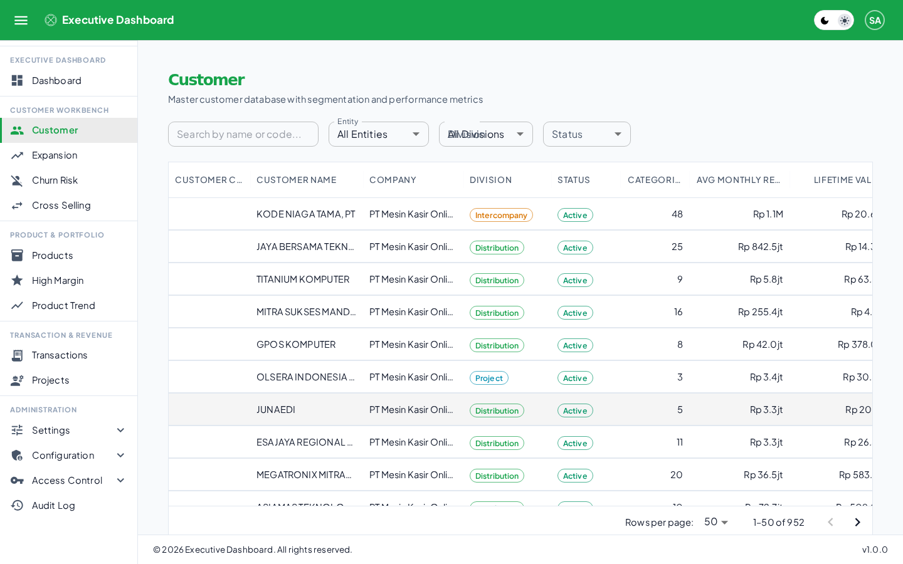

Kolom: kode, nama, perusahaan, divisi, status, jumlah kategori produk, rata-rata belanja bulanan, lifetime value, tanggal transaksi terakhir, total faktur. Ketik di kolom pencarian untuk mencari pelanggan tertentu.

Klik satu baris untuk membuka dialog detail pelanggan:


Isinya: kode dan nama, status dan division (chip), channel penjualan, 4 kotak metrik (Lifetime Value, Rata-rata Revenue Bulanan, Jumlah Kategori, Total Faktur), daftar kategori yang pernah dibeli, grafik kombinasi tren revenue vs gross profit bulanan, dan daftar faktur terbaru (nomor, tanggal, revenue, GP). Dialog ini murni tampilan — tidak ada filter atau export di dalamnya.

### 7.2 Expansion Targets

Berisi 5 metrik (M3–M7) terkait pelanggan existing.

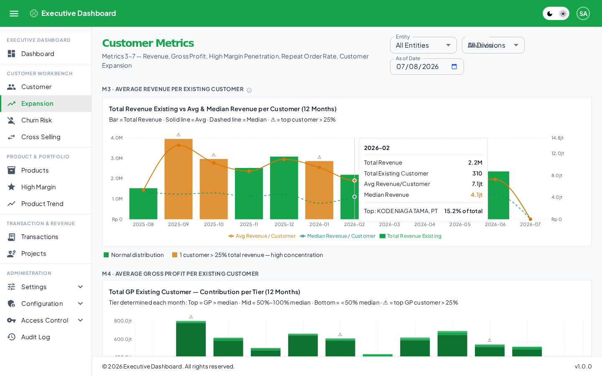

**M3 — Average Revenue per Existing Customer**

```
Avg Revenue = Total revenue existing yang transaksi ÷ Jumlah existing yang transaksi
```

Ditampilkan sebagai grafik kombinasi (batang = total revenue, garis solid = average, garis putus-putus = median) untuk 12 bulan. Kalau 1 pelanggan menyumbang lebih dari 25% total revenue bulan itu, muncul tanda peringatan (⚠) di atas batang bulan tersebut.

**M4 — Average Gross Profit per Existing Customer**

```
Avg GP = Total GP existing yang transaksi ÷ Jumlah existing yang transaksi
```

Dipecah 3 tier berdasarkan median GP bulan itu: **Tier Atas** (GP > median), **Tier Tengah** (50%–100% median), **Tier Bawah** (< 50% median). Klik salah satu batang bulan untuk membuka modal breakdown:


Modal menampilkan ringkasan (Gross Profit Existing Customer, Total Existing, Avg GP/Customer, Median Threshold, jumlah existing yang transaksi bulan itu) dan tabel ranking pelanggan (nomor urut, nama, kode, GP, persentase kontribusi terhadap total, tier). Tombol unduh (ikon panah bawah di pojok kanan atas dialog) mengekspor tabel yang sama ke PDF.

**M5 — High Margin Product Penetration**

```
M5 (%) = Existing customer yang beli ≥1 produk high-margin ÷ TOTAL existing customer
```

Denominator mencakup seluruh existing customer, termasuk yang tidak bertransaksi bulan itu. Produk "high-margin" ditentukan otomatis dari data: margin rate tiap produk dihitung tiap bulan (gross profit ÷ revenue), lalu dibandingkan terhadap threshold (median otomatis, atau nilai tetap yang diatur admin di Settings → Threshold).

**M6 — Repeat Order Rate**

```
M6 (%) = Existing customer dengan ≥2 invoice dalam 30 hari ÷ TOTAL existing customer
```

Target metrik ini bisa diatur admin (default 80%) di Settings → Threshold. Klik grafik radial untuk membuka modal breakdown:

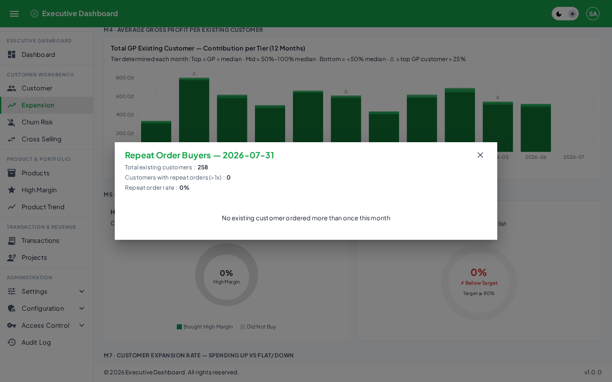

Modal menampilkan total existing customer, jumlah yang melakukan repeat order, dan rate keseluruhan, beserta tabel ranking (kalau ada pelanggan dengan repeat order pada periode yang dipilih — pada contoh di atas, tidak ada existing customer yang order lebih dari 1x pada bulan itu, sehingga tabel kosong).

**M7 — Customer Expansion Rate**

```
Window sekarang   = revenue existing dalam 30 hari terakhir
Window sebelumnya = revenue existing dalam 30 hari sebelum itu

M7 (%) = Existing dengan revenue_sekarang > revenue_sebelumnya ÷ TOTAL existing customer
```

Pelanggan yang tidak order di window sebelumnya tapi order sekarang tetap dihitung sebagai "naik".

### 7.3 Churn Risk

Berisi 3 metrik (M8–M10) terkait pelanggan yang berhenti transaksi.

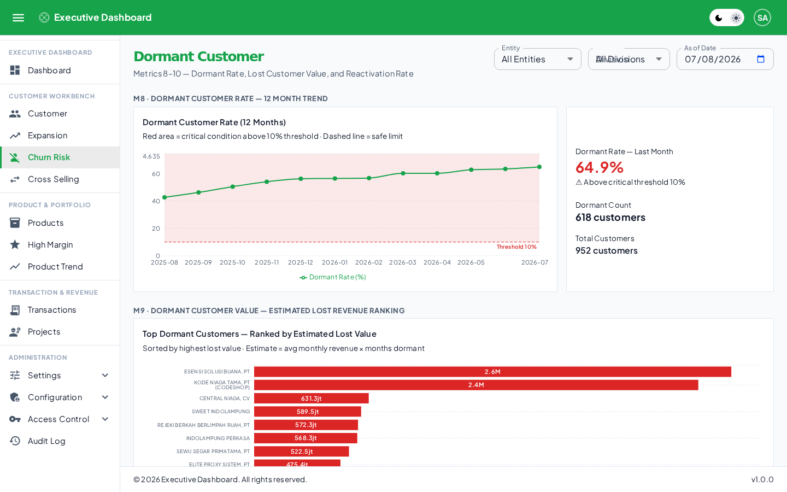

**M8 — Dormant Customer Rate**

```
M8 (%) = Pelanggan dengan transaksi terakhir >90 hari lalu ÷ SELURUH pelanggan di database
```

Ditampilkan dengan garis ambang batas (default 10%, bisa diatur admin) — area di atas garis itu ditandai sebagai kondisi kritis.

**M9 — Dormant Customer Value**

```
M9 = Rata-rata revenue bulanan historis (sebelum dormant) × Jumlah bulan sudah dormant
```

Ditampilkan sebagai ranking horizontal, diurutkan dari potensi kerugian terbesar.

**M10 — Customer Reactivation Rate**

```
M10 (%) = Pelanggan dormant periode lalu yang kembali order ÷ Total pelanggan dormant periode lalu
```

Target minimum yang disarankan 15–20%, ditampilkan sebagai bullet chart terhadap target itu.

### 7.4 Cross Sell Matrix

Berisi 2 metrik (M1–M2) plus matrix Customer × Kategori Produk.

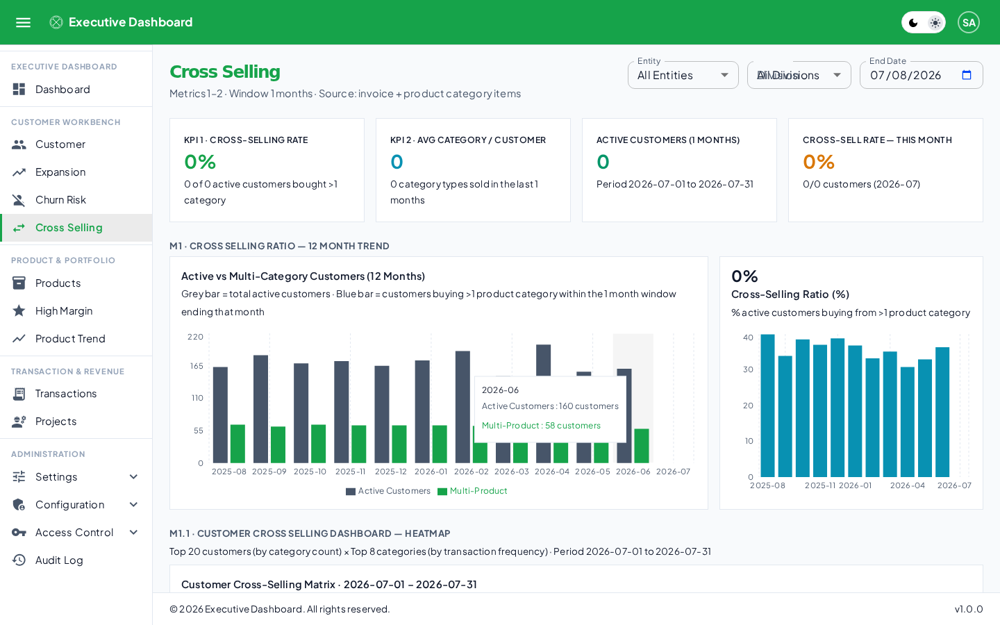

**M1 — Cross Selling Ratio**

```
M1 (%) = Pelanggan aktif dengan ≥2 kategori produk berbeda ÷ TOTAL pelanggan aktif
```

**M2 — Average Category per Customer**

```
M2 = Total kategori unik yang terjual di periode ini ÷ Jumlah pelanggan aktif di periode ini
```

Di bawah kedua metrik itu, heatmap menunjukkan kombinasi Customer × Kategori (Unit/Consumable/Sparepart), dan tabel di bawahnya menampilkan detail per pelanggan (kode, nama, chip kepemilikan tiap kategori, jumlah kategori, total revenue).

---

## 8. Product & Portfolio

### 8.1 Product Ledger

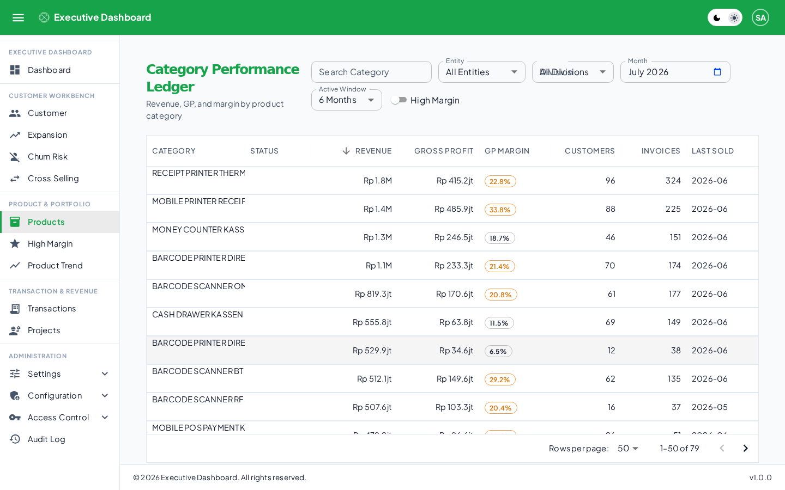

Daftar kategori produk: status high-margin, total revenue, total GP, margin %, jumlah pelanggan pembeli, jumlah transaksi, bulan terakhir terjual. Default terurut dari revenue tertinggi.

Klik satu kategori untuk membuka detail:

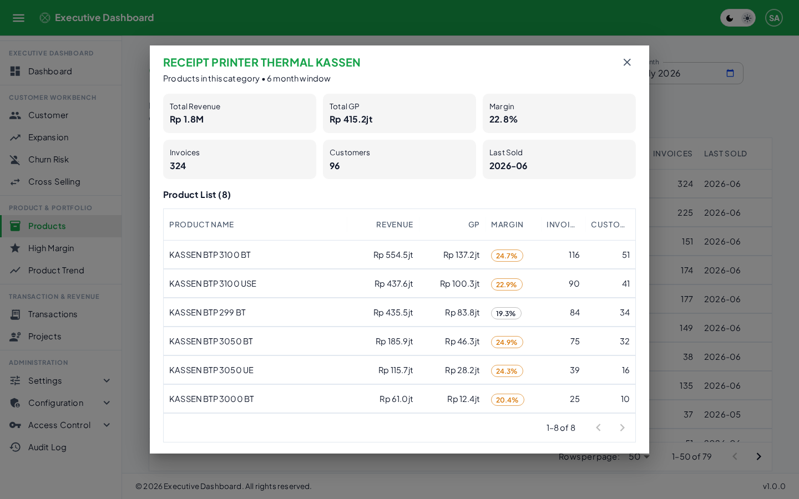

Menampilkan 6 kotak ringkasan (Total Revenue, Total GP, Margin, Invoices, Customers, Last Sold) dan tabel seluruh produk di dalam kategori itu (nama produk, revenue, GP, margin dengan chip warna, jumlah invoice, jumlah customer unik).

### 8.2 High Margin Push

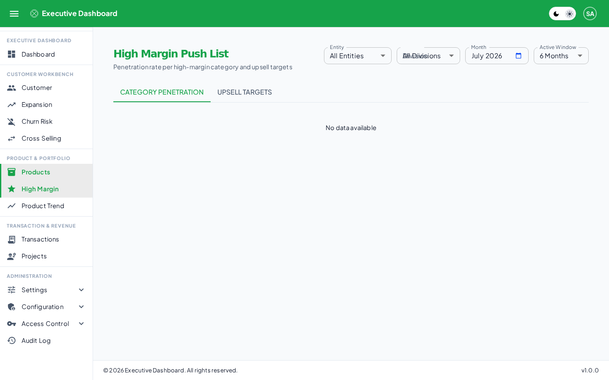

Dua tab: **Category Penetration** (persentase pelanggan existing yang sudah membeli tiap kategori high-margin) dan **Upsell Targets**.

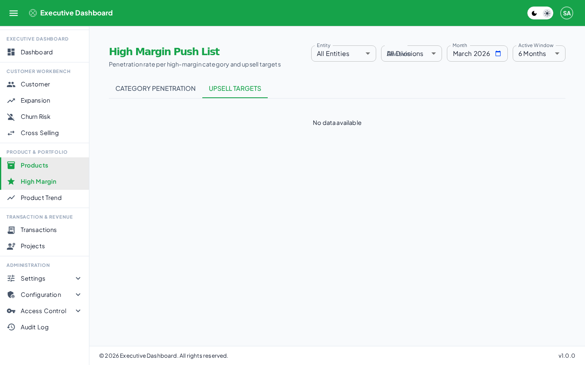

Tab Upsell Targets menampilkan daftar pelanggan yang belum membeli kategori high-margin tertentu pada periode yang dipilih (tampilan "No data available" pada contoh di atas berarti tidak ada kandidat upsell pada periode itu — bisa dicoba dengan mengganti bulan atau Active Window). Klik satu baris pelanggan membuka dialog riwayat pembelian: rata-rata revenue/bulan, tanggal transaksi terakhir, dan tabel produk yang sudah dibeli (kategori, nama produk, revenue, GP, margin, jumlah invoice), dengan opsi filter ke satu kategori tertentu.

### 8.3 Product Trend

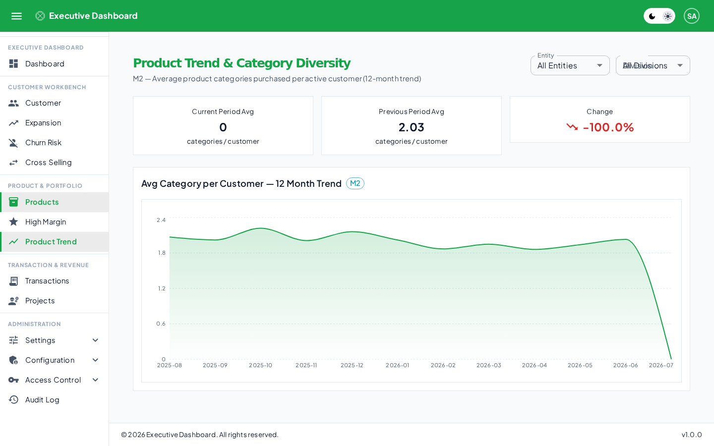

Tren rata-rata jumlah kategori yang dibeli per pelanggan, dibandingkan periode berjalan dengan periode sebelumnya.

---

## 9. Transaction & Revenue

### 9.1 Transaction Ledger

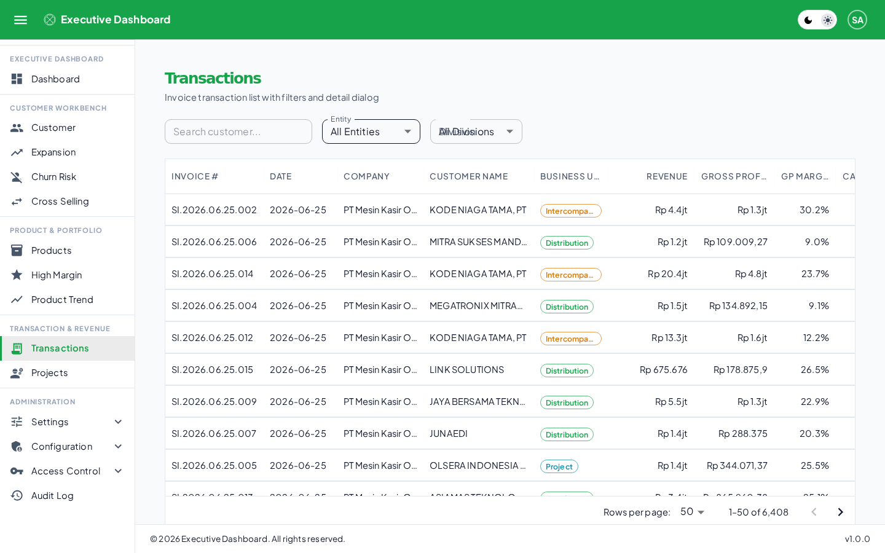

Daftar seluruh faktur: nomor, tanggal, perusahaan, pelanggan, divisi/channel, total revenue, total GP, margin %, jumlah kategori dalam faktur, sumber data (upload file atau sinkron Accurate). Bisa difilter Company/Branch/Division/periode seperti halaman lain.

### 9.2 Project Milestone

Halaman ini masih placeholder — belum ada fitur aktif di baliknya.

---

## 10. Import Data

Semua data masuk lewat satu halaman terpusat (**Administration → Configuration → Import**):


### 10.1 Empat Jenis Import

| Jenis | Kebutuhan | Isi |
|---|---|---|
| Faktur | Company + periode | Data invoice — sumber utama seluruh KPI |
| Channel Divisions | Company | Mapping channel penjualan → Division |
| Klasifikasi Item | Company | Aturan otomatis jenis barang |
| User Baru | — | Bulk-create akun pengguna |

Setiap jenis punya tombol **Template** — file `.xlsx` siap pakai berisi judul, deskripsi kolom, dan contoh data. Memakai template ini adalah cara paling efektif mencegah error format saat upload, karena nama kolom dan nilai enum yang salah adalah dua penyebab error import yang paling sering terjadi.

### 10.2 Cara Import Faktur

Terlihat pada screenshot di atas, ada dua opsi metode:

1. **Upload file** — terima `.csv` atau `.xlsx`, maksimal 10MB. Ini metode yang berfungsi saat ini.
2. **Sync from Accurate API** — panel ini ada di UI, tapi tombol "Sync Now" dalam keadaan nonaktif dengan catatan: *"Automatic sync is not yet available. Ask an admin to enable the 'Accurate Sync Button' toggle in Settings → Threshold once it's ready, or use the file upload instead."* Fitur sinkronisasi otomatis langsung dari Accurate Online masih dalam pengembangan — alur kerja yang berfungsi sekarang adalah export manual dari Accurate Online menjadi file, lalu upload lewat opsi pertama.

### 10.3 Logic Parsing File Faktur

Parser mengenali banyak variasi nama kolom sekaligus (Indonesia dan Inggris) — tidak memaksa satu bentuk nama kolom baku. Contoh, kolom nomor faktur bisa ditulis sebagai salah satu dari: `invoice_number`, `Invoice No`, `No Faktur`, `Nomor Faktur`, `Faktur`, `Invoice`.

Setiap nama kolom dinormalisasi (diubah huruf kecil, karakter selain huruf/angka/spasi/underscore dibuang, spasi diganti underscore) sebelum dicocokkan ke daftar alias — sehingga `"No. Faktur"`, `"no_faktur"`, dan `"NO FAKTUR"` semuanya dikenali sebagai kolom yang sama.

**Kolom yang wajib ada** (minimal salah satu aliasnya ditemukan di file): nomor faktur, tanggal, kode pelanggan, nama pelanggan, kategori produk, revenue, gross profit. Kalau ada kolom wajib yang tidak ditemukan sama sekali, seluruh import ditolak sejak awal dengan pesan kolom apa yang hilang.

Untuk file export resmi Accurate ("Rincian Faktur Penjualan"), parser memindai 10 baris pertama untuk menemukan baris header (dikenali dari keberadaan kolom persis `"Tanggal"` dan `"Sales Invoice"`) — file boleh punya baris judul/metadata di atas tabel data. Setelah header ditemukan, parser memvalidasi semua kolom yang ada memang dikenali (menolak kalau ada kolom asing yang tidak dikenali sama sekali).

Baris yang dilewati otomatis (tidak dianggap error): baris kosong, baris footer laporan (mengandung teks seperti "ACCURATE Accounting System", "Tercetak pada", "Halaman"), atau baris yang nomor invoice-nya tidak diawali `SI.` atau `INV-`.

**Validasi per baris data:** nomor faktur, tanggal, kode pelanggan, nama pelanggan tidak boleh kosong. Kolom angka harus bisa di-parse sebagai angka (koma otomatis dikonversi ke titik desimal) — kalau gagal, baris itu dicatat sebagai error dan dilewati, baris lain tetap diproses. Format tanggal yang didukung: `DD/MM/YYYY`, `YYYY-MM-DD`, dan format teks Accurate seperti `"02 Jun 2026"`.

Setelah parsing dan validasi, sistem mengklasifikasi item (lihat §10.4), me-resolve nama cabang ke `branch_id` (cocok berdasarkan nama, case-insensitive; kalau nama cabang kosong masuk ke branch "Lainnya"; kalau terisi tapi tidak cocok, dibiarkan kosong sebagai sinyal perlu diperiksa manual), lalu menyimpan data: faktur baru di-insert, faktur dengan nomor yang sudah ada di-update (item lama dihapus, item baru dimasukkan) — sehingga mengimpor ulang file yang sama tidak menggandakan data.

### 10.4 Logic Klasifikasi Otomatis Jenis Barang

Setiap baris item faktur diklasifikasikan ke salah satu dari 4 tipe (unit, consumable, sparepart, service) lewat 4 lapis pemeriksaan berurutan:

```
Lapis 1 — keyword_item_name : cocokkan kata kunci pada nama item
Lapis 2 — keyword_category  : cocokkan kata kunci pada nama kategori
Lapis 3 — price_range       : berdasarkan rentang harga satuan
Lapis 4 — fallback          : kalau tidak ada yang cocok, default ke 'unit'
```

Kalau ada lebih dari satu aturan yang cocok, aturan dengan priority tertinggi yang dipakai:

| Jenis Pencocokan | Priority Default |
|---|---|
| Nama item persis sama | 100 |
| Kategori persis sama | 90 |
| Kata kunci di nama item | 70 |
| Kata kunci di kategori | 50 |
| Rentang harga | 30 |

Aturan bisa berlaku global (semua Company) atau khusus satu Company — aturan yang dibuat lewat halaman Import selalu ter-scope ke Company yang dipilih saat upload.

### 10.5 Logic Mapping Channel ke Division

Nilai mentah "Nama Tenaga Penjual"/channel penjualan dari data faktur dipetakan ke satu dari 6 kategori Division:

| Division | Contoh Channel |
|---|---|
| distribution | DC WEST, DC EAST |
| project | SDR B2B WEST, KAE WEST |
| e_commerce | TOKOPEDIA, TIKTOKSHOP, LAZADA |
| intercompany | Transaksi antar-entitas holding |
| freelancer | Salesperson lepas |
| support | Sales support / channel internal |

Mapping ini bisa berbeda per Company atau berlaku global. Kalau nama channel baru muncul di data faktur tapi belum ada pemetaannya, customer terkait tampil dengan Division kosong — perlu ditambahkan mapping baru di Settings → Channel Divisions atau lewat import ulang.

### 10.6 Import User Massal

Kolom template: `name` (wajib), `email` (wajib), `role` (opsional, nama role yang sudah ada), `company_code` (opsional, bisa lebih dari satu dipisah koma).

Saat upload, admin mengisi satu password default yang dipakai untuk semua akun baru dari file itu (bukan per baris, tidak disimpan permanen di server). Aturan per baris: nama/email kosong → error baris; email sudah terdaftar → dilewati (bukan error, aman untuk import ulang); nama role tidak ditemukan → error baris; kode company tidak ditemukan → error baris.

### 10.7 Penanganan Error Import

Untuk semua jenis import, kegagalan di satu baris tidak menggagalkan keseluruhan file — baris valid tetap masuk, baris gagal dicatat terpisah (nomor baris + pesan error) untuk diperbaiki dan diimpor ulang. Riwayat tiap operasi import faktur tersimpan dan bisa dilihat kembali di bagian "Import History" pada halaman yang sama.

### 10.8 Kredensial Accurate Online

Kredensial API (token, signature secret) dienkripsi (AES-256-GCM) sebelum disimpan ke database — tidak pernah dikirim kembali ke browser dalam bentuk terbuka. Tersedia tombol Test Connection untuk validasi sebelum kredensial dipakai.

---

## 11. Audit Log


Setiap aksi yang mengubah data (tambah/ubah/hapus) di seluruh aplikasi tercatat di sini — bersifat permanen, tidak ada endpoint untuk mengubah atau menghapus entry. Kolom yang dicatat: waktu, jenis aksi, pelaku, tabel yang terpengaruh, ID item, dan alamat IP. Bisa difilter berdasarkan jenis aksi dan rentang tanggal. Entry dengan pelaku Super Admin tidak terlihat oleh viewer non-Super-Admin (lihat §4).

---

## 12. Aplikasi Mobile (PWA)

Aplikasi bisa di-install ke homescreen HP maupun desktop lewat browser (tanpa App Store/Play Store) — cari opsi "Add to Home Screen"/"Install App" di menu browser. Setelah terinstall, aplikasi berjalan standalone tanpa address bar browser. Tampilan otomatis menyesuaikan antara mode desktop (tabel penuh) dan mode mobile (tampilan kartu). Data KPI selalu diambil langsung dari server, tidak pernah ditampilkan dari cache lama.

---

## 13. Diagram Arsitektur Data

Diagram berikut ditulis dalam sintaks Mermaid — tampil sebagai gambar di GitHub, GitLab, dan editor Markdown yang mendukungnya. Kalau viewer tidak mendukung, salin ke [mermaid.live](https://mermaid.live).

### 13.1 Diagram Konteks (DFD Level 0)

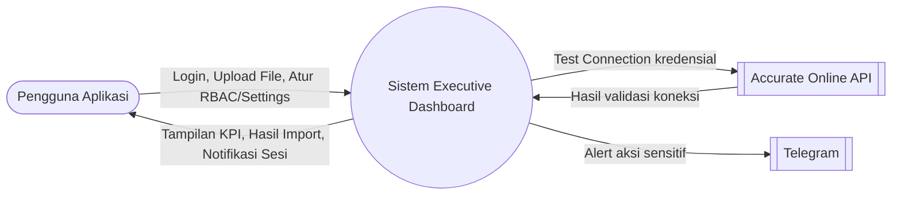

### 13.2 Proses Utama (DFD Level 1)

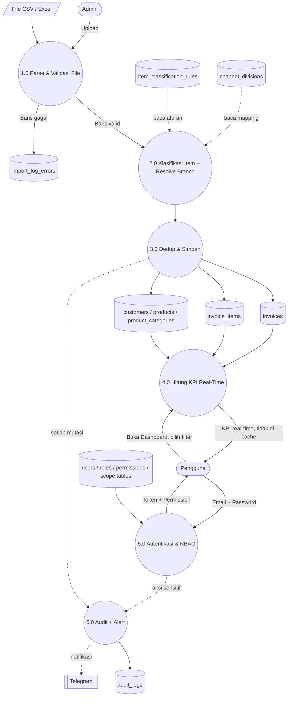

### 13.3 ERD — Data Transaksi & Master

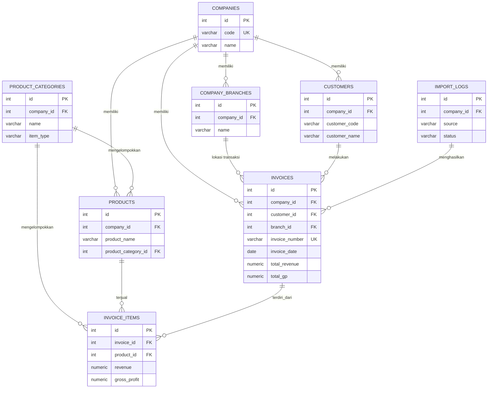

### 13.4 ERD — Akses dan Keamanan (RBAC)

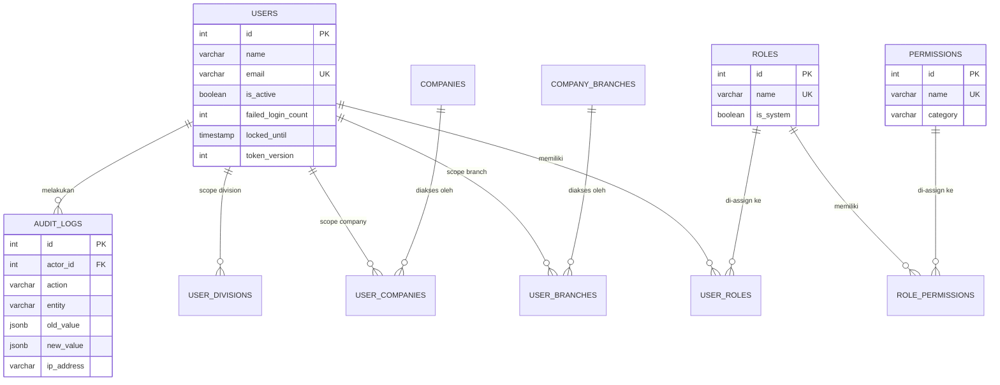

Notasi `||--o{` berarti "satu wajib ke nol-atau-banyak".
