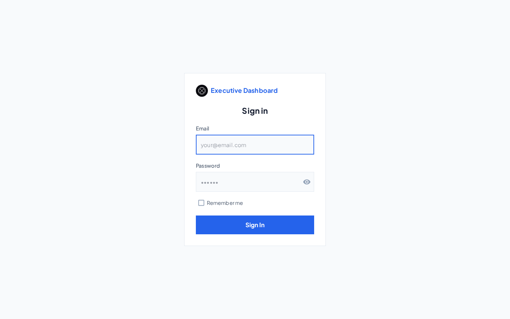
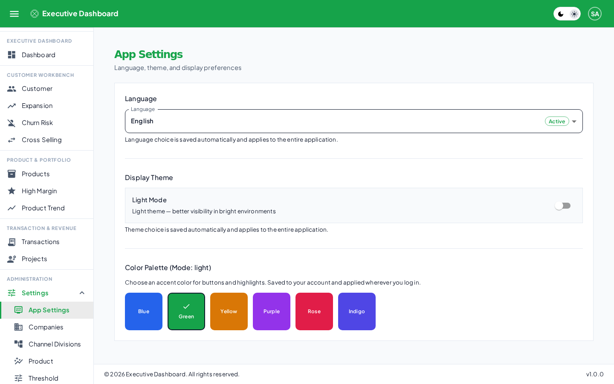
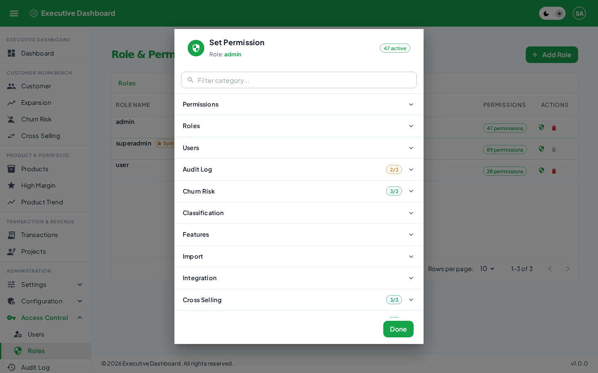
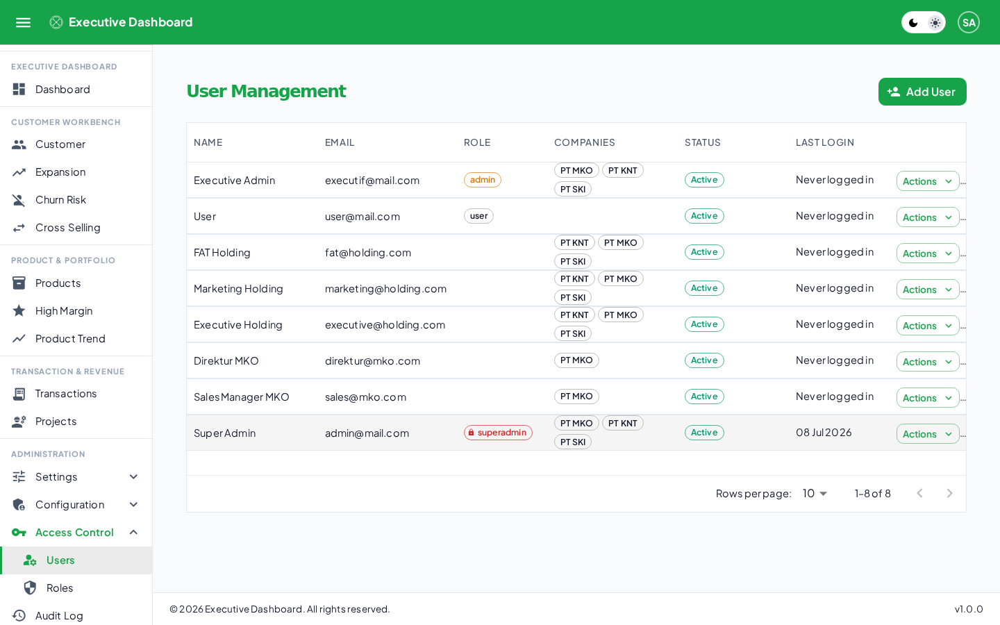
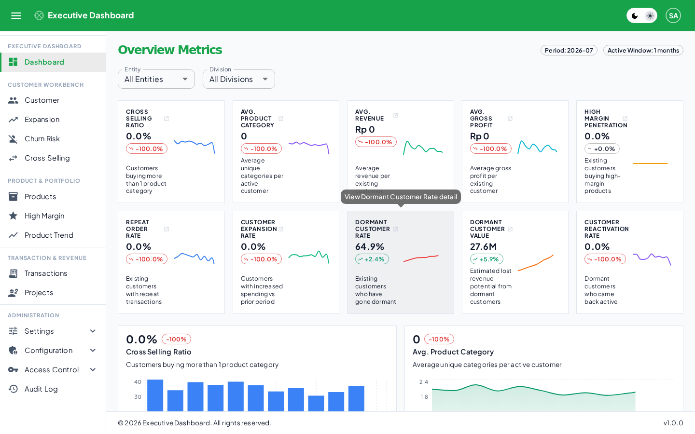
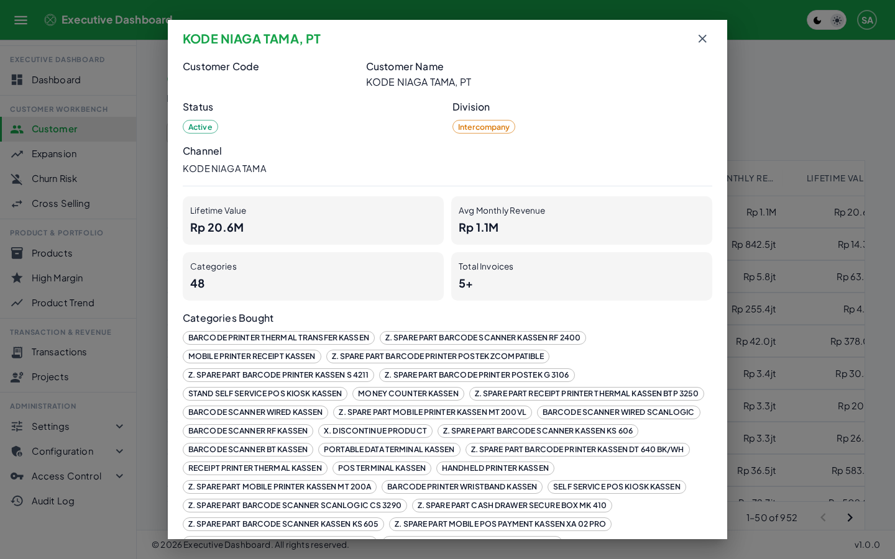
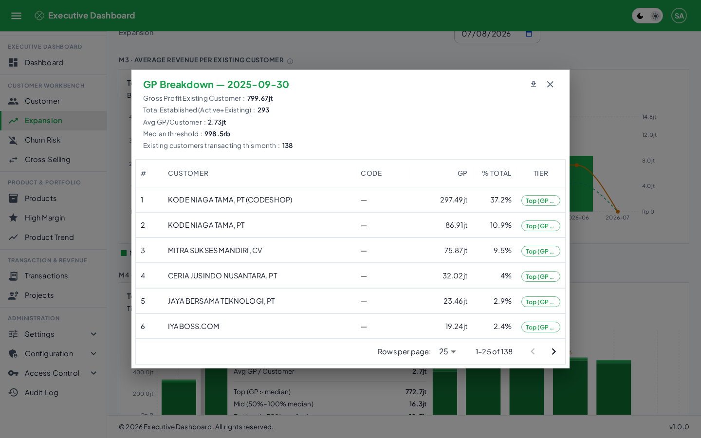
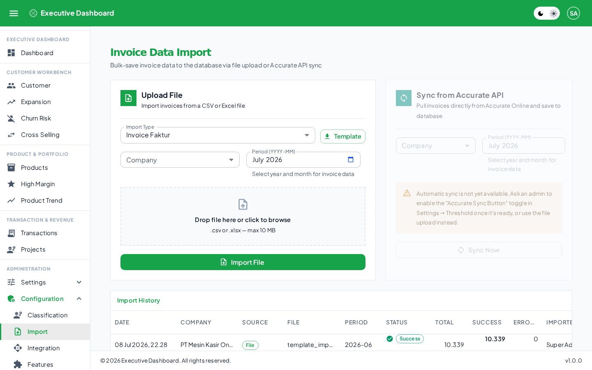
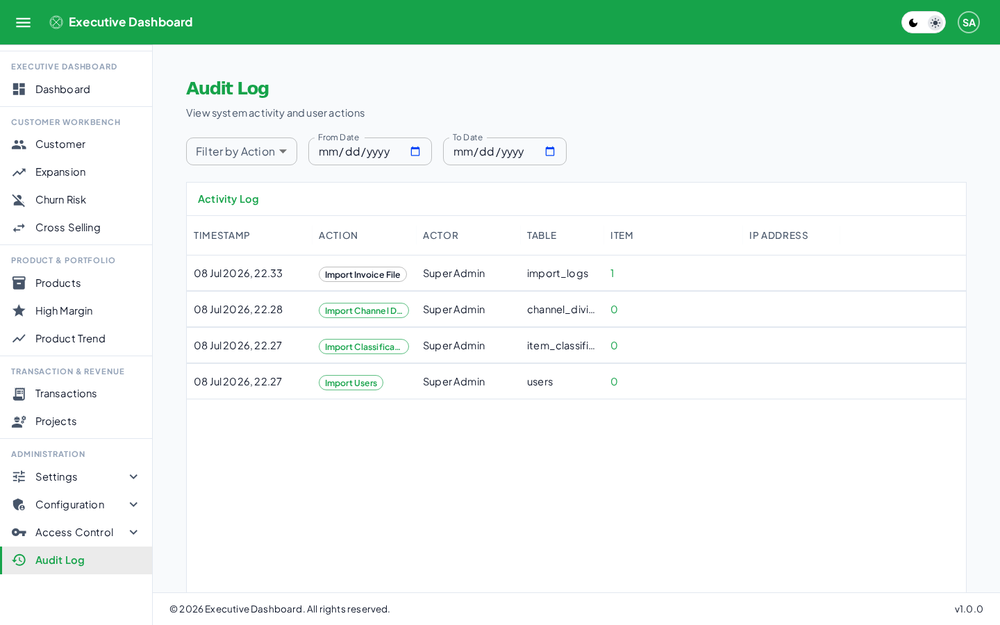

Daftar Isi
==========

[1. Tentang Aplikasi](#tentang-aplikasi)

[1.1 Alur Kerja Singkat](#alur-kerja-singkat)

[1.2 Struktur Data Perusahaan](#struktur-data-perusahaan)

[2. Masuk Aplikasi & Keamanan Akun](#masuk-aplikasi-keamanan-akun)

[2.1 Cara Login](#cara-login)

[2.2 Jika Lupa/Salah Password Berkali-kali](#jika-lupasalah-password-berkali-kali)

[2.3 Reset Password](#reset-password)

[2.4 Notifikasi Keamanan](#notifikasi-keamanan)

[3. Mengatur Preferensi Akun](#mengatur-preferensi-akun)

[3.1 Bahasa](#bahasa)

[3.2 Tema Tampilan](#tema-tampilan)

[3.3 Palette Warna](#palette-warna)

[3.4 Avatar & Menu Akun](#avatar-menu-akun)

[4. Struktur Menu Aplikasi](#struktur-menu-aplikasi)

[4.1 Executive Dashboard](#executive-dashboard)

[4.2 Customer Workbench](#customer-workbench)

[4.3 Product & Portfolio](#product-portfolio)

[4.4 Transaction & Revenue](#transaction-revenue)

[4.5 Administration](#administration)

[5. Mengelola Pengguna & Hak Akses](#mengelola-pengguna-hak-akses)

[5.1 Membuat Role Baru](#membuat-role-baru)

[5.2 Menambahkan Pengguna & Mengatur Cakupan Data](#menambahkan-pengguna-mengatur-cakupan-data)

[5.3 Yang Perlu Diketahui Tentang Tampilan Menu](#yang-perlu-diketahui-tentang-tampilan-menu)

[6. Memahami KPI di Dashboard](#memahami-kpi-di-dashboard)

[6.1 Status Pelanggan](#status-pelanggan)

[6.2 Ringkasan 10 KPI](#ringkasan-10-kpi)

[6.3 Indikator Warna Repeat Order Rate (M6)](#indikator-warna-repeat-order-rate-m6)

[7. Menjelajahi Data Pelanggan & Produk](#menjelajahi-data-pelanggan-produk)

[7.1 Detail Pelanggan](#detail-pelanggan)

[7.2 Rincian di Balik Grafik (Drill-Down)](#rincian-di-balik-grafik-drill-down)

[7.3 Detail Kategori Produk](#detail-kategori-produk)

[8. Mengimpor Data](#mengimpor-data)

[8.1 Jenis Import yang Tersedia](#jenis-import-yang-tersedia)

[8.2 Selalu Gunakan Download Template](#selalu-gunakan-download-template)

[8.3 Cara Import Faktur](#cara-import-faktur)

[8.4 Import Pengguna Massal](#import-pengguna-massal)

[8.5 Status Integrasi dengan Accurate Online](#status-integrasi-dengan-accurate-online)

[9. Audit Log](#audit-log)

[10. Menggunakan Aplikasi di HP (Mobile/PWA)](#menggunakan-aplikasi-di-hp-mobilepwa)

Daftar Gambar
=============

Gambar 1. Halaman Login

Gambar 2. Halaman Dashboard — Ringkasan 10 KPI

Gambar 3. Detail Pelanggan

Gambar 4. Rincian Gross Profit per Pelanggan

Gambar 5. Halaman Role & Permission Management

Gambar 6. Halaman User Management

Gambar 7. Halaman App Settings — Bahasa, Tema, dan Palet Warna

Gambar 8. Halaman Import Data

Gambar 9. Halaman Audit Log

1. Tentang Aplikasi
===================

Executive Dashboard adalah aplikasi analitik bisnis untuk perusahaan yang memiliki beberapa entitas (company). Aplikasi ini mengolah data faktur penjualan menjadi 10 indikator kinerja (KPI) yang dapat dipantau oleh Eksekutif, Manajer, dan Staf sesuai hak akses masing-masing.

1.1 Alur Kerja Singkat
----------------------

- Admin mengunggah data faktur penjualan (file CSV/Excel).
- Sistem memeriksa dan menyimpan data tersebut.
- Sistem menghitung 10 KPI secara otomatis.
- Pengguna (Eksekutif/Manajer/Staf) melihat dashboard sesuai data yang berhak mereka lihat.

1.2 Struktur Data Perusahaan
----------------------------

Data pada aplikasi ditata dalam 3 tingkat, dari yang paling luas ke paling detail:

- **Company** — perusahaan/entitas bisnis.
- **Branch** — cabang di bawah sebuah Company.
- **Division** — divisi/kanal bisnis di bawah sebuah Branch.

> **Catatan:** Setiap pengguna diberikan akses ke kombinasi Company/Branch/Division tertentu. Artinya, dua orang yang login ke aplikasi yang sama bisa melihat data yang berbeda, sesuai dengan apa yang menjadi kewenangan mereka.

2. Masuk Aplikasi & Keamanan Akun
=================================

2.1 Cara Login
--------------

Masuk ke aplikasi menggunakan email dan password yang sudah terdaftar. Setelah pengguna aktif menggunakan aplikasi, sesi login akan diperpanjang secara otomatis di latar belakang sehingga pengguna tidak perlu login berulang kali selama masih aktif menggunakan aplikasi dalam 7 hari terakhir.

*Gambar 1. Halaman Login*

2.2 Jika Lupa/Salah Password Berkali-kali
-----------------------------------------

Demi keamanan, akun akan terkunci sementara apabila terjadi 5 kali percobaan login gagal secara berturut-turut. Selama masa terkunci (kurang lebih 30 menit), akun tidak bisa digunakan untuk login walaupun password yang dimasukkan sudah benar.

- Login yang berhasil akan mengembalikan hitungan gagal ke nol.
- Jika akun terkunci dan Anda butuh akses segera, hubungi Admin — Admin dapat membuka kunci akun secara manual dari halaman Users.

2.3 Reset Password
------------------

Apabila password Anda direset oleh Admin, seluruh sesi login Anda yang sedang aktif di semua perangkat akan otomatis berakhir. Anda perlu login ulang menggunakan password baru pada perangkat mana pun yang Anda gunakan.

2.4 Notifikasi Keamanan
-----------------------

Tim IT/keamanan internal menerima notifikasi otomatis untuk aksi-aksi sensitif, misalnya akun yang terkunci akibat percobaan login gagal berulang, perubahan hak akses admin, atau reset password ke akun admin. Notifikasi ini bersifat informasional bagi tim internal dan tidak memengaruhi pengalaman penggunaan Anda sehari-hari.

3. Mengatur Preferensi Akun
===========================

Halaman **Administration → Settings → App Settings** menyediakan preferensi pribadi yang tersimpan ke akun Anda — sehingga preferensi yang sama akan berlaku di perangkat atau browser mana pun saat Anda login.

3.1 Bahasa
----------

Aplikasi mendukung penuh dua bahasa: Bahasa Indonesia dan English. Seluruh teks pada aplikasi tersedia dalam kedua bahasa tersebut.

3.2 Tema Tampilan
-----------------

- **Light Mode** — cocok untuk lingkungan yang terang.
- **Dark Mode** — mengurangi ketegangan mata di lingkungan yang redup.

3.3 Palette Warna
-----------------

Tersedia 6 pilihan warna aksen yang memengaruhi tampilan tombol, highlight, judul halaman, dan bar atas aplikasi:

| **Palette**    | **Warna Utama** | **Warna Sekunder** |
|----------------|------------------|----------------------|
| Blue (default) | Biru             | Ungu (violet)        |
| Green          | Hijau            | Teal                 |
| Yellow         | Amber            | Oranye               |
| Purple         | Ungu (purple)    | Fuchsia              |
| Rose           | Merah muda tua   | Pink                 |
| Indigo         | Indigo           | Biru langit           |

> **Catatan:** Warna status seperti hijau (sukses), kuning (peringatan), merah (error), dan cyan (info) selalu sama di semua palette, agar sinyal status tidak pernah membingungkan.

*Gambar 7. Halaman App Settings — Bahasa, Tema, dan Palet Warna*

3.4 Avatar & Menu Akun
----------------------

Klik avatar di pojok kanan atas untuk membuka menu berisi nama, email, ringkasan Company/Branch/Division yang Anda miliki akses, tombol menuju halaman Settings, dan tombol Logout.

4. Struktur Menu Aplikasi
=========================

Menu aplikasi dikelompokkan menjadi 5 grup. Menu yang tampil bagi Anda mengikuti hak akses (role) yang diberikan Admin — bisa jadi berbeda antara satu pengguna dengan pengguna lain.

4.1 Executive Dashboard
-----------------------

| **Halaman** | **Fungsi** |
|---|---|
| Dashboard | Ringkasan seluruh 10 KPI dalam satu tampilan, dengan filter Company/Branch/Division. |

4.2 Customer Workbench
----------------------

| **Halaman** | **Fungsi** |
|---|---|
| Customer | Daftar master pelanggan — pencarian, detail riwayat transaksi per pelanggan. |
| Expansion Targets | KPI M3–M7: Revenue, Gross Profit, High Margin Penetration, Repeat Order Rate, Customer Expansion Rate. |
| Churn Risk | KPI M8–M10: Dormant Customer Rate, Dormant Value, Reactivation Rate. |
| Cross Sell Matrix | KPI M1–M2: Cross Selling Ratio, Average Category per Customer. |

4.3 Product & Portfolio
-----------------------

| **Halaman** | **Fungsi** |
|---|---|
| Product Ledger | Daftar & performa kategori produk. |
| High Margin Push | Laporan penetrasi kategori high-margin + daftar target upsell pelanggan. |
| Product Trend | Tren rata-rata kategori produk yang dibeli dari waktu ke waktu. |

4.4 Transaction & Revenue
-------------------------

| **Halaman** | **Fungsi** |
|---|---|
| Transaction Ledger | Daftar seluruh faktur/invoice, dapat difilter Company/Branch/Division/periode. |
| Project Milestone | Placeholder — belum ada fitur backend aktif. |

4.5 Administration
------------------

| **Sub-menu** | **Halaman** | **Fungsi** |
|---|---|---|
| Settings | App Settings | Bahasa, tema, palette. |
| Settings | Companies | Kelola daftar Company & Branch di dalamnya. |
| Settings | Channel Divisions | Mapping nama channel penjualan ke Division. |
| Settings | High Margin Products | Tentukan produk/kategori high-margin per periode. |
| Settings | Threshold | Atur target KPI (mis. target Repeat Order Rate). |
| Configuration* | Classification Rules | Aturan otomatis klasifikasi jenis item dari data import. |
| Configuration* | Import | Halaman terpusat upload data. |
| Configuration* | Integration | Kredensial & koneksi ke Accurate Online. |
| Configuration* | Features | Toggle on/off visibility tiap halaman aplikasi. |
| Access Control | Users | Kelola pengguna. |
| Access Control | RBAC | Kelola role & permission. |
| Audit Log | — | Riwayat seluruh aksi mutasi data di sistem. |

> **Catatan:** Menu Configuration hanya bisa diakses oleh Super Admin.

5. Mengelola Pengguna & Hak Akses
=================================

Bagian ini untuk Admin/Super Admin yang bertugas mengatur siapa boleh mengakses apa. Ada dua hal terpisah yang perlu diatur untuk setiap pengguna:

- **Role (hak melakukan aksi)** — menentukan menu dan tombol apa saja yang boleh dipakai (lihat, tambah, ubah, hapus, ekspor).
- **Scope (cakupan data)** — menentukan Company/Branch/Division mana saja yang datanya boleh dilihat.

> **Catatan:** Kedua hal ini independen. Dua pengguna dengan Role yang sama persis tetap bisa melihat data yang berbeda total jika Scope Company/Branch/Division mereka berbeda.

5.1 Membuat Role Baru
---------------------

Dari menu Administration → Access Control → RBAC:

- Klik tombol "Add Role", isi nama dan deskripsi (contoh: "Sales Manager Cabang").
- Role baru dibuat tanpa hak akses apa pun — perlu langkah berikutnya untuk mengaktifkan aksesnya.
- Klik ikon perisai (Assign Permissions) pada role tersebut untuk membuka daftar checklist hak akses, dikelompokkan per kategori halaman.
- Centang kombinasi hak akses yang diinginkan, lalu simpan.

*Gambar 5. Halaman Role & Permission Management*

> **Catatan:** Role bawaan "Admin" dan "User" dapat diubah, di-rename, atau dihapus sesuai kebutuhan lewat halaman ini. Hanya role "Super Admin" yang dikunci permanen dan tidak bisa dihapus/di-rename.

5.2 Menambahkan Pengguna & Mengatur Cakupan Data
------------------------------------------------

Dari menu Administration → Access Control → Users:

- Assign Role — pilih satu Role untuk pengguna tersebut.
- Assign Company/Branch/Division — pilih secara berjenjang: pilih Company dulu, baru muncul pilihan Branch di dalamnya, baru muncul pilihan Division. Satu pengguna bisa diberi akses ke lebih dari satu Company/Branch/Division sekaligus.

*Gambar 6. Halaman User Management*

Dari halaman yang sama, Admin juga dapat:

- Mereset password pengguna (pengguna tersebut otomatis logout dari semua perangkat dan wajib login ulang).
- Mengunci atau membuka kunci akun secara manual.
- Melihat status aktif/terkunci tiap pengguna.
- Menambahkan banyak pengguna sekaligus lewat import file (lihat bagian 8.4).

5.3 Yang Perlu Diketahui Tentang Tampilan Menu
----------------------------------------------

Jika sebuah pengguna tidak diberi hak akses "menu" untuk suatu halaman, halaman tersebut tidak akan muncul sama sekali di sidebar-nya. Begitu pula tombol Tambah/Edit/Hapus/Ekspor — akan otomatis tersembunyi total (bukan sekadar berwarna abu-abu) jika pengguna tidak punya hak untuk aksi tersebut.

6. Memahami KPI di Dashboard
============================

Seluruh KPI dihitung otomatis dari data faktur yang sudah diimpor, diperbarui secara real-time (tidak disimpan sebagai cache lama). Berikut penjelasan masing-masing dari 10 KPI.

6.1 Status Pelanggan
--------------------

Sebagai dasar, setiap pelanggan digolongkan ke salah satu dari 4 status berikut, dihitung relatif terhadap tanggal yang dipilih:

| **Status** | **Artinya** |
|---|---|
| Aktif | Ada transaksi dalam 30 hari terakhir. |
| Existing | Pertama kali beli lebih dari 30 hari lalu, dan masih bertransaksi dalam 90 hari terakhir. |
| Dormant | Tidak ada transaksi sama sekali dalam 90 hari terakhir. |
| New | Pertama kali beli dalam 30 hari terakhir ini. |

6.2 Ringkasan 10 KPI
--------------------

*Gambar 2. Halaman Dashboard — Ringkasan 10 KPI*

| **Kode** | **Nama KPI** | **Penjelasan** |
|---|---|---|
| M1 | Cross Selling Ratio | Persentase pelanggan aktif yang membeli lebih dari 1 kategori produk berbeda. |
| M2 | Average Category per Customer | Rata-rata jumlah jenis kategori produk yang dibeli per pelanggan aktif. |
| M3 | Average Revenue per Existing Customer | Rata-rata pendapatan dari pelanggan existing yang bertransaksi bulan itu. Muncul tanda peringatan jika satu pelanggan menyumbang lebih dari 25% total revenue. |
| M4 | Average Gross Profit per Existing Customer | Rata-rata laba kotor dari pelanggan existing, dikelompokkan menjadi 3 tingkat (Atas/Tengah/Bawah) berdasarkan nilai tengah (median) laba kotor bulan itu. |
| M5 | High Margin Product Penetration | Persentase pelanggan existing yang membeli minimal 1 produk kategori high-margin bulan itu. Produk high-margin ditentukan otomatis dari data (bisa juga diatur manual di Settings → Threshold). |
| M6 | Repeat Order Rate | Persentase pelanggan existing yang bertransaksi lebih dari 1 kali dalam 30 hari terakhir. Target dapat diatur di Settings → Threshold (default 80%). |
| M7 | Customer Expansion Rate | Persentase pelanggan existing yang pengeluarannya naik dibanding 30 hari sebelumnya. |
| M8 | Dormant Customer Rate | Persentase pelanggan yang tidak bertransaksi sama sekali selama 90 hari, dari seluruh pelanggan. |
| M9 | Dormant Customer Value | Estimasi nilai (rupiah) yang berpotensi hilang dari tiap pelanggan dormant, berdasarkan rata-rata omzet bulanan sebelum menjadi dormant. |
| M10 | Customer Reactivation Rate | Persentase pelanggan dormant periode lalu yang kembali bertransaksi di periode ini. Target yang disarankan: 15–20%. |

6.3 Indikator Warna Repeat Order Rate (M6)
------------------------------------------

- Hijau — pencapaian minimal 100% dari target.
- Kuning — pencapaian minimal 75% dari target.
- Merah — pencapaian di bawah 75% dari target.

7. Menjelajahi Data Pelanggan & Produk
=======================================

Selain ringkasan angka, hampir setiap halaman menyediakan cara untuk melihat data sampai ke tingkat pelanggan/produk individual — berguna saat Anda perlu tahu siapa saja di balik satu angka KPI.

7.1 Detail Pelanggan
---------------------

Klik satu baris pelanggan di halaman Customer untuk membuka profil lengkapnya: status, division, channel penjualan, ringkasan Lifetime Value/Rata-rata Revenue Bulanan/Jumlah Kategori/Total Faktur, daftar kategori yang pernah dibeli, grafik tren revenue vs gross profit bulanan, dan daftar faktur terbaru.

*Gambar 3. Detail Pelanggan*

7.2 Rincian di Balik Grafik (Drill-Down)
------------------------------------------

Di halaman Expansion Targets, grafik Gross Profit (M4) dan Repeat Order Rate (M6) bisa diklik untuk membuka rincian per pelanggan pada bulan yang dipilih — nama, kode, kontribusi, dan (khusus Gross Profit) tombol untuk mengekspor rincian itu ke PDF.

*Gambar 4. Rincian Gross Profit per Pelanggan*

7.3 Detail Kategori Produk
----------------------------

Di halaman Product Ledger, klik satu kategori untuk melihat seluruh produk di dalamnya beserta revenue, gross profit, margin, jumlah invoice, dan jumlah pelanggan pembeli masing-masing produk.

8. Mengimpor Data
=================

*Gambar 8. Halaman Import Data*

Semua data masuk lewat satu halaman terpusat: **Administration → Configuration → Import** (khusus Super Admin). Ada 4 jenis import yang dipilih lewat dropdown "Tipe Import", masing-masing punya tombol Download Template sendiri, dan wajib memilih Company tujuan sebelum upload.

8.1 Jenis Import yang Tersedia
------------------------------

| **Jenis** | **Kebutuhan Tambahan** | **Isi** |
|---|---|---|
| Faktur | Company + periode (bulan) | Data invoice/faktur penjualan — sumber utama seluruh KPI. |
| Channel Divisions | Company | Mapping nama channel penjualan ke Division. |
| Klasifikasi Item | Company | Aturan otomatis pengelompokan jenis barang. |
| User Baru | Password default untuk semua akun baru | Bulk-create akun pengguna. |

8.2 Selalu Gunakan Download Template
------------------------------------

Tombol Download Template menghasilkan file Excel siap pakai yang berisi judul, penjelasan tiap kolom (termasuk nilai-nilai yang valid), baris header dengan nama kolom yang benar, dan beberapa baris contoh data. Menggunakan template ini adalah cara paling efektif untuk menghindari error saat import, karena kesalahan yang paling sering terjadi adalah nama kolom yang salah atau nilai yang salah ketik.

8.3 Cara Import Faktur
----------------------

- File yang diterima: .csv atau .xlsx, maksimal 10MB.
- Untuk file besar, tersedia progress bar real-time yang menunjukkan berapa baris sudah diproses/sukses/gagal.
- Mengimpor ulang file yang sama tidak akan menggandakan data — faktur yang sudah ada otomatis diperbarui (bukan dobel).
- Jika ada baris yang datanya tidak valid, baris tersebut dilewati dan dicatat sebagai error, tapi baris lain yang valid tetap diproses — jadi satu kesalahan tidak menggagalkan keseluruhan file.
- Riwayat setiap import faktur tersimpan dan bisa dilihat kembali, lengkap dengan jumlah baris sukses/gagal dan pesan error tiap baris yang gagal.

8.4 Import Pengguna Massal
--------------------------

Untuk menambahkan banyak akun sekaligus (misalnya saat onboarding tim baru), gunakan tipe import "User Baru". Kolom yang perlu diisi: nama (wajib), email (wajib), role (opsional), dan kode company (opsional, bisa lebih dari satu dipisah koma).

- Semua akun baru dari satu file menggunakan satu password default yang sama, yang diisi Admin saat upload. Pengguna disarankan segera mengganti password masing-masing setelah login pertama.
- Email yang sudah terdaftar sebelumnya akan otomatis dilewati (bukan dianggap error) — aman untuk mengimpor ulang file yang sama.

8.5 Status Integrasi dengan Accurate Online
-------------------------------------------

Menu Configuration → Integration memungkinkan Anda menyimpan kredensial koneksi ke Accurate Online dan menguji apakah koneksi tersebut berhasil (Test Connection).

> **Catatan:** Sinkronisasi otomatis data faktur langsung dari Accurate Online BELUM tersedia saat ini. Menyimpan kredensial di menu Integration tidak akan otomatis memasukkan data faktur ke aplikasi. Cara yang berfungsi saat ini adalah: export data secara manual dari Accurate Online menjadi file Excel/CSV, lalu unggah file tersebut lewat halaman Import seperti biasa.

9. Audit Log
============

*Gambar 9. Halaman Audit Log*

Setiap aksi yang mengubah data (tambah/ubah/hapus) di seluruh aplikasi otomatis tercatat secara permanen di halaman Audit Log dan tidak bisa diubah atau dihapus oleh siapa pun lewat aplikasi.

Anda dapat memfilter Audit Log berdasarkan jenis aksi, pelaku, company, dan rentang tanggal.

10. Menggunakan Aplikasi di HP (Mobile/PWA)
==========================================

Aplikasi ini dapat dipasang (install) langsung ke homescreen HP (Android/iOS) maupun desktop layaknya aplikasi biasa, tanpa perlu mengunduh dari App Store/Play Store.

- Setelah dipasang, ikon aplikasi (logo daun semanggi berdaun empat) akan muncul di homescreen.
- Aplikasi berjalan tanpa address bar browser, seperti aplikasi native.
- Data KPI yang ditampilkan selalu diambil langsung dari server (fresh), sehingga angka yang Anda lihat selalu akurat dan terkini.
- Tampilan otomatis menyesuaikan: tabel penuh di layar besar, tampilan kartu yang lebih mudah dibaca di layar HP.
